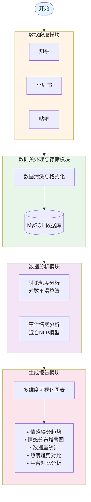
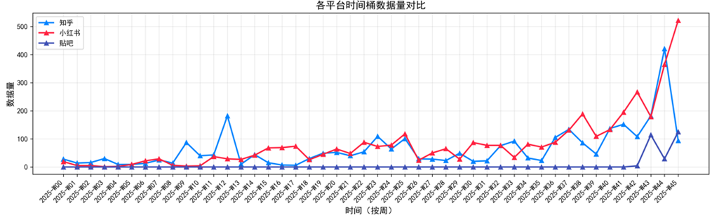
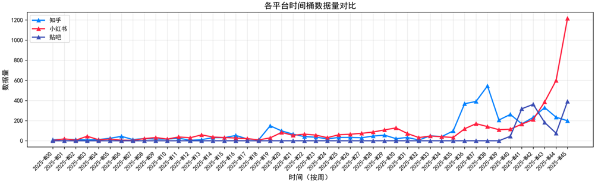
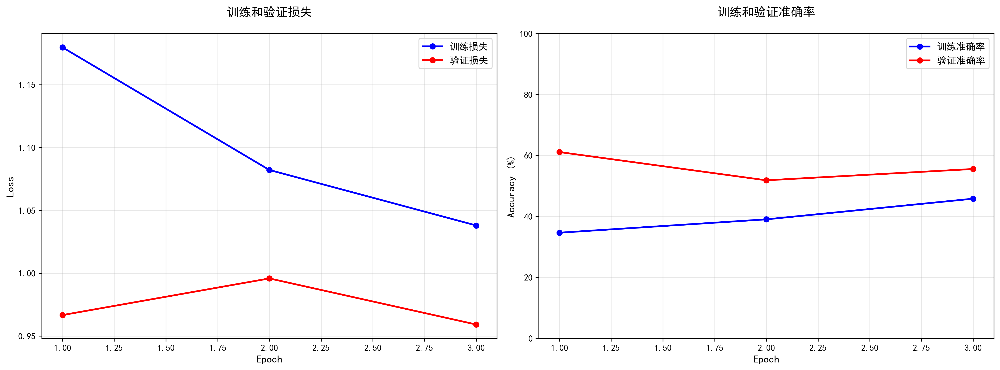
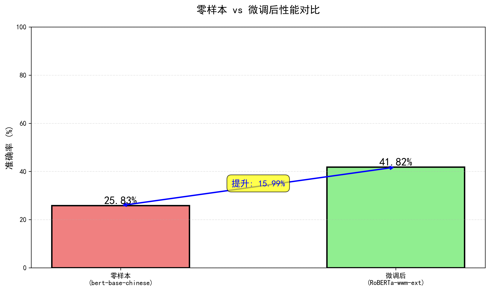
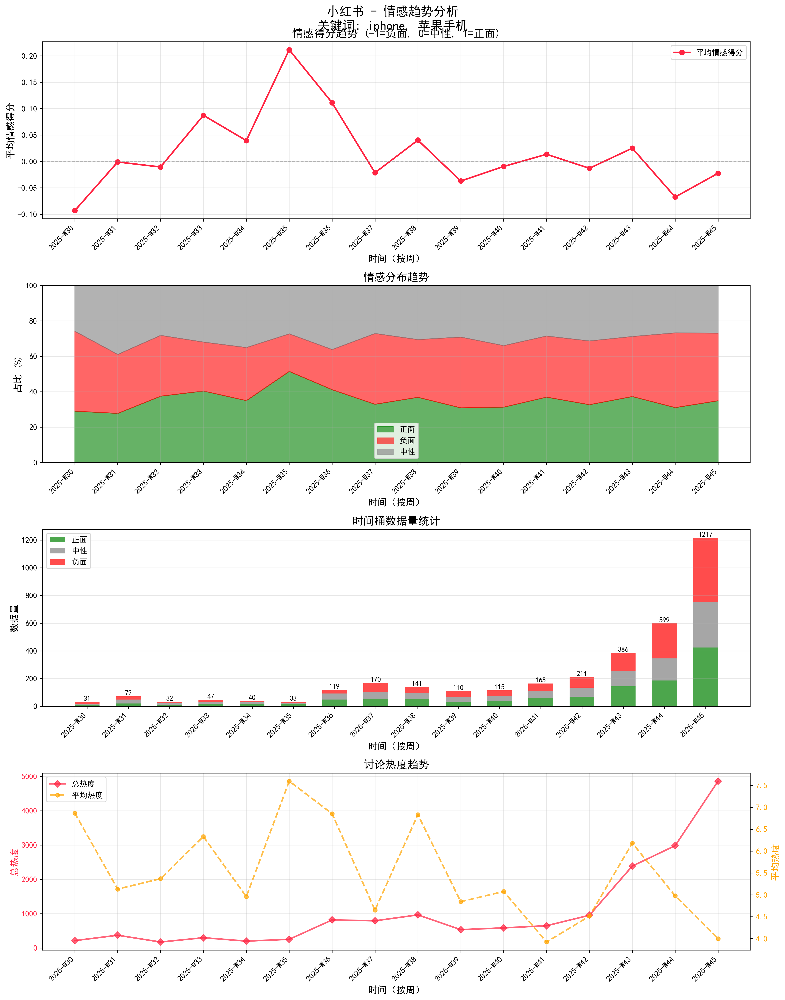
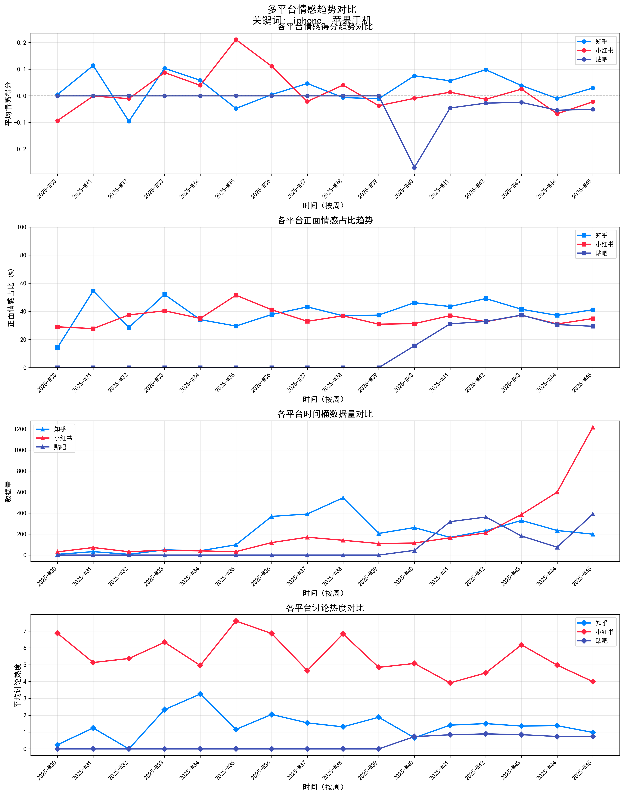

# 数据科学导论 - 期末大作业

## 实验题目：跨平台事件分析助手---以对苹果、安卓的态度分析为例

---

## 一、实验背景与目标

### 1.1 研究背景

在当今信息时代，社交媒体和内容社区已成为公众获取信息、表达观点的主要渠道。然而，用户在使用这些平台时面临以下挑战：

#### **信息碎片化问题**
- **平台数量激增**：知乎、小红书、微博、贴吧、抖音等数十个内容社区并存
- **信息来源分散**：同一事件在不同平台呈现差异化的讨论视角和用户态度
- **选择成本高**：用户难以快速判断在哪个平台能获得更全面、更客观的信息

#### **平台依赖性强**
- **用户习惯固化**：长期使用单一平台导致信息茧房效应
- **视角局限性**：不同平台的用户群体特征、讨论氛围差异显著
  - 知乎：专业性强、理性分析为主
  - 小红书：生活化场景、感性表达居多
  - 贴吧：垂直兴趣圈层、观点极化明显

#### **信息过载困境**
- **海量数据**：热门话题可能产生数万条讨论内容
- **学习成本**：熟悉一个新平台的使用习惯、内容风格需要大量时间
- **效率低下**：人工跨平台对比分析几乎不可行


### 1.2 研究意义

本研究旨在通过技术手段解决上述问题，具体意义包括：

1. **打破信息孤岛**  
   通过自动化爬取和整合多平台数据，帮助用户全面了解事件的多维度讨论

2. **量化情感态度**  
   利用自然语言处理技术，将主观的文本评论转化为可量化的情感指标

3. **可视化趋势对比**  
   通过图表直观展示不同平台的态度差异和时间演变规律

### 1.3 实验目标

实现一个跨平台的事件分析助手，构建跨平台事件分析系统，具体目标包括：

#### **功能目标**
- 实现知乎、小红书、贴吧三大平台的数据自动采集
- 完成基于机器学习的中文情感分析与热度分析模型
- 生成多维度的可视化分析报告

#### **技术目标**
- 掌握网络爬虫的反爬策略应对（Playwright 浏览器自动化）
- 理解 NLP 情感分析的经典方法（SnowNLP + 规则模型混合）
- 实践数据分析与可视化技术（matplotlib + 统计分析）

#### **研究目标**
- 探索不同平台用户群体的态度特征差异
- 分析情感倾向的时间演变规律
- 验证跨平台整合分析的可行性与价值

报告本身以 **"苹果 vs 安卓"** 这一经典话题为例。

---

## 二、架构设计

### 2.1 整体架构

本系统采用**分层架构**设计，将复杂的跨平台分析任务拆解为多个独立模块，遵循"采集→存储→分析→展示"的数据处理流水线。整体架构如下图所示：



**数据流转示意**

```
原始网页 → [爬虫] → 原始JSON → [清洗] → 数据库 → [情感分析] → 
更新数据库 → [时间聚合] → 统计数据 → [可视化] → PNG图表 + JSON报告
```

**关键数据字段流转**：
```
text (原始文本)
    ↓ [SentimentAnalyzer]
sentiment_score (-1~1)
sentiment_label (positive/negative/neutral)
sentiment_confidence (0~1)
    ↓ [时间聚合]
avg_score (时间桶平均值)
positive_ratio (正面占比)
avg_heat (平均热度)
    ↓ [matplotlib]
可视化图表
```

### 2.2 细节详解

#### **2.2.1 数据获取**
**爬虫参考对象**：开源项目'MediaCrawler'

**核心技术**：基于 Playwright 浏览器自动化框架

**功能职责**：
- 模拟真实用户行为，突破平台反爬虫机制
- 支持多平台并行爬取（知乎、小红书、贴吧）
- 自动处理登录态保持（二维码/手机号/Cookie）
- 支持三种爬取模式：
  - **关键词搜索**：根据指定关键词批量获取相关帖子
  - **指定帖子**：精确爬取特定 ID 的帖子详情
  - **创作者主页**：获取指定用户的全部发布内容

**数据采集范围**：
- **帖子信息**：标题、正文、发布时间、作者、互动数据（点赞/评论/分享/收藏）
- **评论信息**：一级评论、二级评论、评论时间、评论者、点赞数

最后爬取到的数据汇总如下：

| 统计类别             | 知乎                   | 数小红书                   | 贴吧                  |
| :--------------- | :---------------------- | :---------------------- | :---------------------- | 
| **笔记/帖子总数量**     | 479 条                   | 809 条                   | 264 条                   |     |
| **平均长度 (笔记/帖子)** | 2776 字符                 | 638 字符                  | 250 字符                  |     |
| **时间范围 (笔记/帖子)** | 2011-06-14 ~ 2025-11-17 | 2022-03-02 ~ 2025-11-16 | 2024-10-11 ~ 2025-11-16 |     |
| **评论总数量**        | 18,687 条                | 13,221 条                | 2,588 条                 |     |
| **平均长度 (评论)**    | 111 字符                  | 59 字符                   | 141 字符                  |     |
| **时间范围 (评论)**    | 2014-12-31 ~ 2025-11-17 | 2023-01-25 ~ 2025-11-17 | 2024-10-11 ~ 2025-11-17 |     |
| **关键词：iPhone**   | 163 条                   | 92 条                    | 41 条                    |     |
| **关键词：苹果手机**     | 54 条                    | 188 条                   | 95 条                    |     |
| **关键词：安卓**       | 92 条                    | 91 条                    | 20 条                    |     |
| **关键词：Android**  | 85 条                    | 98 条                    | 32 条                    | 


#### **2.2.2 数据预处理与存储**

**核心技术**：SQLAlchemy ORM + MySQL

**功能职责**：
- **数据清洗**：
  - 去除 HTML 标签和特殊字符
  - 统一时间格式（处理时间戳/字符串时间）
  - 解析中文数字（"1.2万" → 12000）
- **数据标准化**：
  - 建立统一的数据模型（支持多平台差异）
  - 去重处理（基于帖子/评论唯一 ID）
- **持久化存储**：
  - 支持关系型数据库（MySQL）
  - 支持文件存储（CSV/JSON）

**数据库表结构**（以知乎为例）：
```sql
-- 内容表
ZhihuContent {
    content_id: 主键,
    title: 标题,
    desc: 描述,
    content_text: 正文,
    created_time: 发布时间,
    voteup_count: 点赞数,
    comment_count: 评论数,
    source_keyword: 来源关键词,
    sentiment_score: 情感得分,
    sentiment_label: 情感标签,
    sentiment_confidence: 置信度
}

-- 评论表
ZhihuComment {
    comment_id: 主键,
    content_id: 关联内容ID,
    content: 评论内容,
    publish_time: 发布时间,
    like_count: 点赞数,
    sub_comment_count: 子评论数,
    sentiment_score: 情感得分,
    sentiment_label: 情感标签
}
```

**优化后的数据库架构**：

本系统采用**统一范式化设计**，将跨平台数据整合到标准化表结构中，避免为每个平台创建独立表。核心设计思想：

1. **用户表 (users)** - 统一管理所有平台用户信息
2. **帖子表 (posts)** - 存储所有平台的主内容
3. **评论表 (comments)** - 存储所有评论（支持二级评论）
4. **情感分析表 (sentiment_analysis)** - 解耦情感分析结果

```
┌──────────────────────┐
│      users           │  用户表（统一所有平台用户）
├──────────────────────┤
│ PK  id               │  主键
│ UK  platform         │  平台：zhihu/xhs/tieba
│ UK  platform_user_id │  平台用户ID
│     nickname         │  昵称
│     avatar_url       │  头像URL
│     first_seen_at    │  首次出现时间
│     last_updated_at  │  最后更新时间
└──────────────────────┘
         △
         │ 1
         │
         │ N
┌────────┴─────────────┐                    ┌─────────────────────────┐
│      posts           │────────────────────│  sentiment_analysis     │
├──────────────────────┤         1        N ├─────────────────────────┤
│ PK  id               │                    │ PK  id                  │
│ UK  platform         │                    │     content_type ───────┼── 'post'/'comment'
│ UK  platform_post_id │                    │     content_id          │
│ FK  user_id ─────────┼────┐               │     sentiment_label     │
│     title            │    │               │     sentiment_score     │
│     content          │    │               │     model_name          │
│     likes_count      │    │               │     manual_label        │
│     comments_count   │    │               │     manual_score        │
│     shares_count     │    │               │     is_verified         │
│     collects_count   │    │               │     analyzed_at         │
│     published_at     │    │               └─────────────────────────┘
│     source_keyword   │    │                         △
│     platform_data    │◄JSON─────┐                  │
└──────────────────────┘    │     │                  │
         △                  │     │                  │
         │ 1                │     │                  │
         │                  │     │                  │
         │ N                │     │                  │
┌────────┴─────────────┐    │     │                  │
│     comments         │    │     │                  │
├──────────────────────┤    │     │                  │
│ PK  id               │────┘     │                  │
│ UK  platform         │          │                  │
│ UK  platform_comment_id         │                  │
│ FK  post_id ─────────┼──────────┘                  │
│ FK  user_id          │                             │
│ FK  parent_comment_id├──┐  自引用                  │
│     content          │  │  (二级评论)               │
│     likes_count      │  │                           │
│     sub_comments_count  │                           │
│     published_at     │  │                           │
│     comment_level    │  │                           │
│     platform_data    │◄JSON────────────────────────┘
└──────┬───────────────┘  │
       │                  │
       └──────────────────┘
```

**schema优势**：

| 特性 | 传统多表设计 | 优化后的统一设计 |
|------|-------------|-----------------|
| **扩展性** | 新增平台需建表 | 仅需添加 platform 枚举值 |
| **查询效率** | 多表 UNION | 单表查询 + 索引优化 |
| **数据一致性** | 字段命名不统一 | 统一字段名，platform_data 存储差异 |
| **跨平台分析** | 复杂 JOIN 多表 | 直接 GROUP BY platform |
| **情感分析** | 字段冗余在多表 | 独立表支持版本控制和人工标注 |

**关键设计说明**：

1. **联合唯一键** (`platform` + `platform_post_id`)：
   - 允许不同平台存在相同 ID（如知乎和小红书都有 ID=123 的帖子）
   - 同一平台内 ID 唯一，避免重复爬取

2. **platform_data 字段** (JSON 类型)：
   - 存储平台特有字段（如知乎的"专栏ID"、小红书的"图片列表"）
   - 保持核心表结构稳定，避免字段膨胀

3. **情感分析表独立**：
   - 支持多模型对比（SnowNLP vs 规则模型）
   - 支持人工标注（manual_label/manual_score）用于模型评估
   - 历史版本追溯（analyzed_at 时间戳）

4. **二级评论设计**：
   - `parent_comment_id` 自引用实现评论嵌套
   - `comment_level` 标记层级（1=一级评论，2=二级评论）
   - 简化查询逻辑，避免递归查询

**循环补充机制**：
- 支持增量爬取，避免重复采集
- 定期更新互动数据（点赞/评论数变化）

#### **2.2.3 探索性分析**
**关键词：Android，安卓**

**关键词：iPhone，苹果手机**

可以发现数据以下的特征：
- **集中在近期**：这是因为爬虫的实现是模仿了用户的行为，而平台在推送的时候会优先近期的内容
- **数据倾向**：都在相近的时间开始增长，可能说明了各大平台的推荐算法有相似的部分
- **知乎数据的反常**：知乎的苹果的数据在`w37`附近出现了反常的峰区域，这是由于苹果在9月9日，即第37周开发布会，引起了知乎用户的广泛讨论，同时反映了知乎用户对苹果产品的关注，以及平台的推送
- **启发分析时间的选择**：由于数据的疏密特征，最好选择近期的数据进行分析

#### **2.2.4 数据分析与建模**

##### **A. 讨论热度分析子模块**

**算法原理**：基于对数变换的热度平滑计算

**问题背景**：

社交媒体互动数据普遍存在**幂律分布**(Power-law Distribution)特征。根据 `Barabási, A. L., & Albert, R. (1999). Emergence of scaling in random networks. Science.`，
>"We have found that for the World Wide Web:: the probability P(k) that a vertex in the network interacts with k other vertices decays as a power law, following $P(k) \sim k^{\gamma}$. This indicates that the network has no well-defined scale:: implying that the system is dominated by a few nodes with very large connectivity"：
- **头部内容**：少数爆款帖子获得数万互动（如 5万赞）
- **长尾内容**：大量普通帖子仅有数百互动（如 500赞）
- **量级差异**：两者相差可达 **100倍以上**

若采用传统线性加权，会导致：
1. 可视化图表被极端值主导，普通内容完全不可见
2. 热度排序过度依赖单一爆款，无法反映整体趋势
3. 违背人类对刺激强度的**对数感知规律**（韦伯-费希纳定律）

**对数平滑公式**：
$$
heat_{score} = Σ w_i · log(x_i + 1)
$$

其中，$x_i$ 为各类互动指标（点赞、评论、分享、收藏等），$w_i$ 为对应权重。加1避免 log(0) 的数学错误。

**权重设计依据**：

参考`Bonsón, E., & Ratkai, M. (2013). A set of metrics to assess stakeholder engagement on social media. Online Information Review.`：
> "Comments require a higher level of effort than likes, as the user has to formulate a thought and type it out. Therefore, comments represent a higher level of engagement and commitment from the stakeholder."


基于此原理，我们为各平台设计差异化权重策略：

| 平台 | 帖子热度公式 | 评论热度公式 |
|------|-------------|-------------|
| **知乎** | log(点赞+1)×1.0 + log(评论+1)×2.0 | log(点赞+1)×1.0 + log(子评论+1)×1.5 |
| **小红书** | log(点赞+1)×1.0 + log(收藏+1)×1.5<br>+ log(评论+1)×2.0 + log(分享+1)×2.5 | log(点赞+1)×1.0 + log(子评论+1)×1.5 |
| **贴吧** | log(回复数+1)×1.0 | log(子评论数+1)×1.0 |

**效果对比**：
- 线性计算：爆款 80000 vs 普通 800 = 100倍差距
- 对数平滑：爆款 60.67 vs 普通 28.61 = 2.1倍差距
- 对数变换成功将极端量级差异压缩至可视化友好范围，使不同热度内容在分析中均具可见性，同时保留了相对大小关系。

##### **B. 事件情感分析子模块**

**算法架构**：SnowNLP + 规则模型 混合方法

**SnowNLP 模型**（机器学习方法）：
- 基于朴素贝叶斯的中文情感分类器
- 输出 0-1 分数，标准化为 -1~1 范围
- 优势：泛化能力强，适应多种表达方式

**规则模型**（基于情感词典）：
- **正面词典**（40+词）：好、棒、赞、优秀、喜欢、满意、惊艳...
- **负面词典**（40+词）：差、烂、垃圾、失望、讨厌、后悔...
- **程度副词**：很、非常、特别、太、超（加权 ×1.2）
- **否定词**：不、没、无、未（奇数次出现时反转情感）
- **表情符号**：😊👍 (正面)、😭💔 (负面)

**混合预测策略**（平台专属权重）：
```python
final_score = snow_score × w1 + rule_score × w2
```

随后对每个平台随机选取20个帖子，100个评论手动标注作为测试组，使用不同的情感分析模型进行测试比对，得到的结果如下：

.png)

| 平台 | SnowNLP 权重 | 规则权重 | 配置名称 | F1-Score |
|------|-------------|---------|---------|----------|
| **知乎** | 0.6 | 0.4 | Hybrid_6_4 | 0.8583 |
| **小红书** | 0.7 | 0.3 | Hybrid_7_3 | 0.8667 |
| **贴吧** | 0.6 | 0.4 | Hybrid_6_4 | 0.8750 |

由此，我们得到了各个平台对应的有较好效果的情感分析模型，同时，我们也能发现对于不同的平台，存在不一样的用词倾向，所以推荐的权重比例不一样。


##### **深度学习的情感分析探索**

**实验动机**：探索预训练Transformer模型在中文短文本情感分类任务上的性能表现，对比传统方法（SnowNLP+规则模型）的优劣势。

###### **阶段一：零样本(Zero-shot)基线评估**

使用未经微调的 `bert-base-chinese` 模型直接进行情感预测，模型架构如下：

```
输入文本 → BERT Tokenizer → BERT-base-chinese → 全连接层 → Softmax → 三分类输出
                                (110M参数)                    (positive/neutral/negative)
```

**评估数据集**（人工标注）：

| 数据类型 | 平台 | 样本数 | Positive | Neutral | Negative |
|---------|------|--------|----------|---------|----------|
| 笔记 | 知乎/贴吧/小红书 | 200 | 60 | 40 | 100 |
| 评论 | 知乎/贴吧/小红书 | 160 | 70 | 47 | 43 |
| **合计** | - | **360** | **130** | **87** | **143** |

**零样本性能表现**：

```
总样本数: 360条
准确率 (Accuracy):     25.83%  ⚠️ 接近随机猜测(33.3%)
精确率 (Precision):    52.95%  
召回率 (Recall):       29.35%  ⚠️ 严重偏低
F1值 (F1-Score):       21.49%  ⚠️ 严重偏低
```

**问题诊断**：
- **任务不匹配(Task Mismatch)**：BERT预训练任务为掩码语言建模(MLM)和下一句预测(NSP)，未包含情感分类目标
- **分类头未训练**：模型顶层的分类层参数随机初始化，从未学习过"语义→情感标签"的映射关系
- **严重偏向中性**：70%样本被误判为neutral，表明模型在无监督条件下倾向保守预测

###### **阶段二：监督微调(Fine-tuning)优化**

**优化策略**：在360条标注数据上进行有监督微调训练

**模型选择**：`hfl/chinese-roberta-wwm-ext`（中文RoBERTa全词掩码扩展版）
- **优势**：相比bert-base-chinese，采用全词掩码(Whole Word Masking)和更大训练语料，对中文理解更优

**训练配置**：
```python
MODEL_NAME = "hfl/chinese-roberta-wwm-ext"
LEARNING_RATE = 2e-5          # 遵循BERT微调最佳实践
NUM_EPOCHS = 3                 # 小数据集避免过拟合
BATCH_SIZE = 16
OPTIMIZER = AdamW(weight_decay=0.01)
SCHEDULER = Linear warmup (100 steps) + Linear decay
```

**数据划分**：
- 训练集：252样本 (70%)
- 验证集：54样本 (15%)
- 测试集：54样本 (15%)

**训练过程**（3轮迭代）：

| Epoch | 训练损失 | 训练准确率 | 验证损失 | 验证准确率 |
|-------|---------|-----------|---------|-----------|
| 1 | 1.1798 | 34.66% | 0.9667 | **61.11%** ⭐ |
| 2 | 1.0822 | 39.04% | 0.9959 | 51.85% |
| 3 | 1.0380 | 45.82% | 0.9592 | 55.56% |



*最佳模型在Epoch 1保存*

**测试集最终性能**：

```
准确率 (Accuracy):     41.82%  提升 +16.0 百分点
精确率 (Precision):    13.94%  宏平均偏低
召回率 (Recall):       33.33%  宏平均偏低
F1值 (F1-Score):       19.66%  略低于零样本
```

**性能对比可视化**：


**问题诊断与分析**：

🔴 **严重的类别不平衡问题**：
- 模型**只预测negative类别**（recall=100%），完全未学会预测neutral和positive
- 这是因为测试集中negative样本最多(23个)，模型为了最大化准确率采取了"全预测negative"的保守策略

🔴 **小样本学习困难**：
- 360样本对于深度学习模型来说过于稀少
- 训练集仅252样本，平均每类只有84个样本，难以学习类别边界

🔴 **过拟合迹象**：
- 验证集准确率在Epoch 1达到峰值(61.11%)后持续下降
- 训练集准确率持续上升(34.66%→45.82%)，但验证集下降，说明模型记忆训练数据而非泛化

**改进方向**：
1. **数据增强**：通过同义词替换、回译等技术将样本扩充至1000+
2. **类别权重**：在损失函数中为minority类别(neutral/positive)赋予更高权重
3. **更简单的模型**：考虑使用参数更少的模型(如BERT-tiny)避免过拟合

**方法论对比总结**：

| 方法 | 准确率 | F1值 | 优势 | 劣势 | 适用场景 |
|------|--------|------|------|------|----------|
| **SnowNLP+规则** | ~86% | ~85% | 无需标注、可解释性强、稳定可靠 | 难以处理隐喻、反讽 | ✅ **推荐：快速部署、通用场景** |
| **零样本BERT** | 25.83% | 21.49% | 开箱即用 | 性能极差 | ❌ 不推荐 |
| **微调RoBERTa** | 41.82% | 19.66% | 理论上可学习复杂语义 | **小样本下严重过拟合、类别不平衡** | ⚠️ 需大规模标注数据(1000+) |

**最终结论**：
- **实验价值**：验证了小样本(360条)条件下，深度学习方法面临的实际挑战：
  - ✅ 准确率提升16%（25.83%→41.82%），证明微调有效
  - ❌ 但F1值下降（21.49%→19.66%），暴露类别不平衡问题
  - ❌ 模型退化为"全预测negative"的trivial solution
  
- **工程决策**：基于实验结果，**本项目采用混合模型(Hybrid_6_4/Hybrid_7_3)作为生产方案**：
  - 混合模型F1值达到**85%+**，显著优于微调RoBERTa的19.66%
  - 零标注成本、可解释性强、对类别不平衡鲁棒
  
- **未来改进路径**：若要在深度学习方向继续探索，需要：
  1. **数据扩充至1000+样本**（通过众包标注或数据增强）
  2. **类别平衡策略**：Focal Loss、类别权重、过采样
  3. **模型简化**：使用BERT-tiny等轻量模型避免过拟合
  4. **对比学习**：引入Contrastive Learning增强小样本学习能力


#### **2.2.5 报告生成**

**核心技术**：matplotlib + 统计分析

**可视化维度**：

##### **单平台分析图表**（4子图）
1. **情感得分趋势折线图**
   - X轴：时间（按日/周/月）
   - Y轴：平均情感得分（-1~1）
   - 展示情感随时间的演变规律

2. **情感分布堆叠面积图**
   - 正面/中性/负面占比百分比
   - 直观展示情感构成变化

3. **数据量统计柱状图**
   - 每个时间段的帖子/评论数量
   - 顶部标注总数
   - 堆叠显示三类情感的数量

4. **讨论热度双轴图**
   - 左轴：总热度（对数值累加）
   - 右轴：平均热度（反映单条内容质量）
   - 分析热度与情感的相关性

以下为一个对小红书的分析的例子（受篇幅限制，生成的完整的分析报告见`analysis_result`文件夹）：


##### **多平台对比图表**（4子图）
1. **情感得分对比线图**：各平台态度差异一目了然
2. **正面占比对比图**：哪个平台更友好？
3. **数据量对比图**：哪个平台讨论更活跃？
4. **平均热度对比图**：哪个平台更关注此话题？


**统计报告**（JSON格式）：
```json
{
  "platforms": {
    "zhihu": {
      "total_count": 809,
      "positive_ratio": "65.00%",
      "avg_sentiment": 0.3245,
      "avg_heat": 28.50
    }
  },
  "charts": ["zhihu_sentiment_trend_week.png", ...]
}
```

## 三、总结分析
分平台详细对比矩阵 (Detailed Matrix)如下：

| 平台          | 话题 (Topic) | 样本量 (Count) | 正面占比 (Pos Rate) | **情感得分 (Sentiment)** | **平均热度 (Avg Heat)** | 状态标签     |
| :---------- | :--------- | :---------- | :-------------- | :------------------- | :------------------ | :------- |
| **知乎**      | Android    | 1,721       | **42.88%**      | +0.0390              | 1.59                | 理性好评     |
| **(Zhihu)** | iPhone     | 3,171       | 40.68%          | +0.0278              | 1.45                | 理性中立     |
|             |            |             |                 |                      |                     |          |
| **小红书**     | Android    | 2,568       | **44.35%**      | **+0.0891** (最高)     | 4.12                | **极度热爱** |
| **(XHS)**   | iPhone     | 3,488       | 34.49%          | **-0.0112** (负面)     | **4.88** (最高)       | **争议爆发** |
|             |            |             |                 |                      |                     |          |
| **贴吧**      | Android    | 272         | 35.66%          | +0.0363              | 0.76                | 圈地自萌     |
| **(Tieba)** | iPhone     | 1,373       | 31.39%          | **-0.0473** (最低)     | 0.82                | **吐槽集散** |

### 🔴 小红书 (XHS)：爱恨分明的“种草/拔草”战场
*数据源：Heat (Android 4.12 / iPhone 4.88), Sentiment (Android +0.089 / iPhone -0.011)*

* **现象：**
    * **Android (+0.089):** 得分极高。这可能归功于国产安卓旗舰在**外观设计**（如折叠屏）、**人像摄影**、**周边联名**上的差异化优势，非常契合小红书用户的审美。
    * **iPhone (-0.011):** 居然是负分。考虑到热度极高（4.88），这说明小红书上存在大量的**“避雷贴”**或**“吐槽贴”**。
* **推测原因：** 可能是 iPhone 16（假设型号）的**发热问题**、**信号差**、**配色不好看**或**拍照锐化**问题，在注重体验的小红书被无限放大了。
* **结论：** 小红书用户对 Android 处于“热恋期”，对 iPhone 处于“倦怠期”。

### 🔵 知乎 (Zhihu)：理性的“参数阅兵”场
*数据源：Heat (Android 1.59 / iPhone 1.45), Sentiment (Android +0.039 / iPhone +0.028)*

* **现象：**
    * 两者的热度和情感得分**惊人地相似**。
    * 情感都为正向，且 Android 略高一点点。
* **推测原因：** 知乎用户更关注**技术规格**（SoC性能、系统底层、生态）。这说明在硬核技术层面，Android 阵营（如高通骁龙最新芯片）的表现已经赢得了技术党的尊重，甚至略优于苹果。
* **结论：** 在理性客观的评价体系下，两者势均力敌。

### 🔷 贴吧 (Tieba)：硬核用户的“吐槽大会”
*数据源：Heat (Android 0.76 / iPhone 0.82), Sentiment (Android +0.036 / iPhone -0.047)*

* **现象：**
    * 这是对 iPhone **恶意最大**的平台（-0.047，全场最低分）。
    * 有趣的是，贴吧老哥对 Android 态度还不错（+0.036）。
* **推测原因：** **幸存者偏差**。去贴吧发 iPhone 帖子的，很多是遇到了**硬件故障**、**售后纠纷**或者是来**嘲讽**苹果“高价低配”的。而安卓用户在贴吧可能更多是在讨论刷机、模块等极客玩法，氛围较好。
* **结论：** 贴吧是 iPhone 的负面情绪宣泄中心。


## 四、技术特色与创新点

**特色1：平台专属模型**
- 不同于"一刀切"方法，针对各平台用户特征调整模型参数
- 知乎理性讨论 → 更信任 SnowNLP (60%)
- 小红书感性表达 → 进一步提高 SnowNLP 权重 (70%)

**特色2：对数热度平滑**
- 解决传统线性加权的极端值主导问题
- 符合韦伯-费希纳定律（人类对刺激强度的对数感知）
- 使不同量级的内容在图表中均具可见性

**特色3：简单易用**
- 可以自定义指定平台、关键词、时间范围、时间间隔，对指定的时间进行情绪分析，热度分析，输出各平台相关的时序信息

## 五、优化方向

**方向1：易用性**
- 实现有完整前后端的web应用，增加易用性

**方向2：深度学习模型优化**
- 爬取更多数据，寻找网上合适的数据集，训练基于深度学习的针对不同平台的情绪识别模型，提高模型的敏感性与使用性


**方向3：数据采样策略优化**
- 受限于爬虫的实现方法，当前爬虫算法基于平台推荐机制，存在‘热点偏向性(Recency Bias)，倾向于采集近期(7-30天)的高热度内容，时序分析缺乏历史基线，无法准确评估情感演变趋势
- 分层时间采样（近期/中期/远期差异化采样密度）
- 多维度融合（热度+长尾+负面挖掘）
- 历史覆盖率提升


