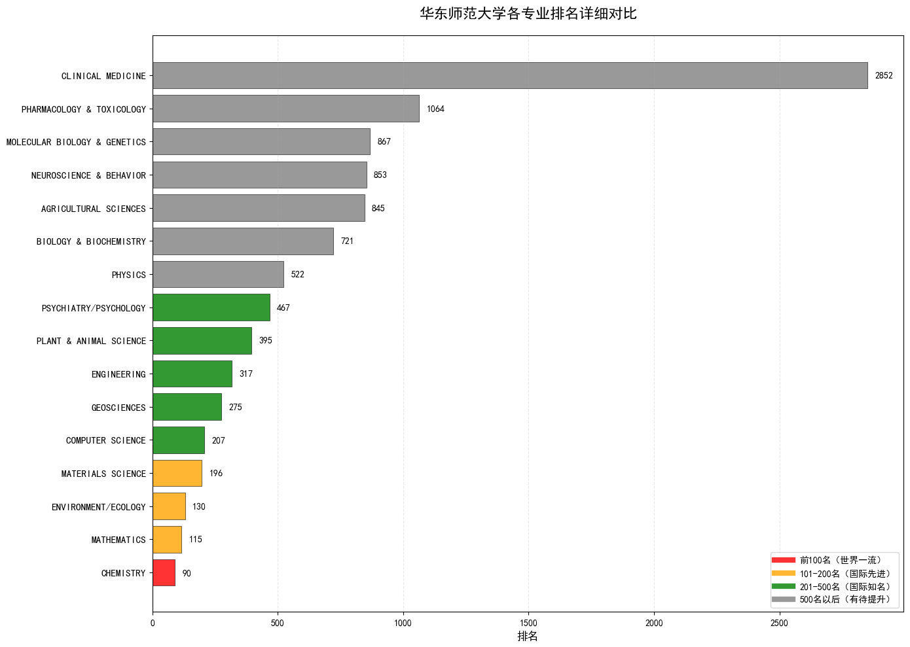
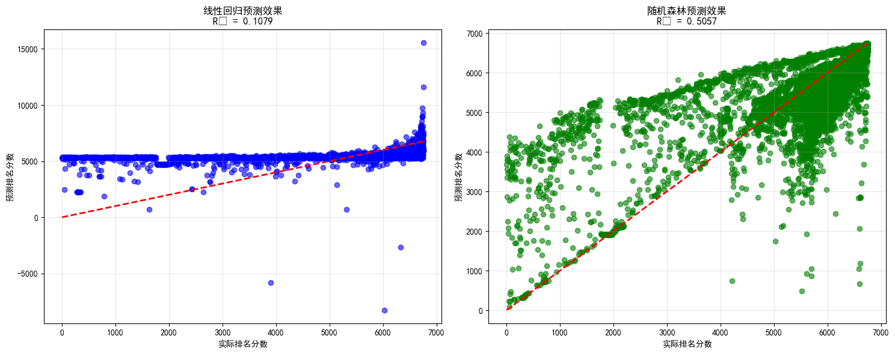

# 数据结构导论 - 第三次作业实验

## 实验题目：华东师范大学专业排名分析

**实验日期：** 2025年10月2日

---

## 实验目的
通过编程训练，能用一些爬虫工作实现网络数据的爬取。

## 问题重述
1. 使用Python语言，设计一个网络数据爬取工具，能够自动的获取ESI学科排名的相关数据。ESI的网站如下：
https://clarivate.com/academia-government/scientific-and-academic-research/research-funding-analytics/essential-science-indicators/
2. 通过爬虫获取的数据，对华东师范大学的学科情况进行数据分析，并形成一份报告文件。

## 实验环境
采用Python语言并利用Jupyter Notebook编程实现。

## 华东师范大学的科情况数据分析
### 数据清洗与预处理
继承 lab2 的思路，对爬取的数据进行预处理，检查缺失值与重复值，结果如下表所示：
| 列名            | 缺失值数量 |
| ------------- | ----- |
| 专业            | 0     |
| rowSeq        | 0     |
| institutions  | 0     |
| Country       | 3050  |
| wosDocs       | 0     |
| cites         | 0     |
| citesPerPaper | 0     |

| 列名            | 数据类型    |
| ------------- | ------- |
| 专业            | object  |
| rowSeq        | int64   |
| institutions  | object  |
| Country       | object  |
| wosDocs       | int64   |
| cites         | int64   |
| citesPerPaper | float64 |

这边可以发现国家的缺失值较多，这是因为许多的组织为跨国界的组织，所以网站并未统计其国籍。
### 专业分析
华东师范大学各专业数据如下表所示:
| 专业                           | 排名   | 总学校数 | 论文数  | 引用次数   | 平均引用次数 |
| ---------------------------- | ---- | ---- | ---- | ------ | ------ |
| CHEMISTRY                    | 90   | 2141 | 5420 | 164390 | 30.33  |
| MATHEMATICS                  | 115  | 395  | 2019 | 11984  | 5.94   |
| ENVIRONMENT/ECOLOGY          | 130  | 2066 | 2941 | 92088  | 31.31  |
| MATERIALS SCIENCE            | 196  | 1580 | 2720 | 93969  | 34.55  |
| COMPUTER SCIENCE             | 207  | 863  | 1803 | 22336  | 12.39  |
| GEOSCIENCES                  | 275  | 1175 | 1850 | 42158  | 22.79  |
| ENGINEERING                  | 317  | 2787 | 2567 | 55450  | 21.60  |
| PLANT & ANIMAL SCIENCE       | 395  | 1950 | 1375 | 21843  | 15.89  |
| PSYCHIATRY/PSYCHOLOGY        | 467  | 1147 | 1460 | 15243  | 10.44  |
| PHYSICS                      | 522  | 995  | 3495 | 50802  | 14.54  |
| BIOLOGY & BIOCHEMISTRY       | 721  | 1649 | 897  | 20837  | 23.23  |
| AGRICULTURAL SCIENCES        | 845  | 1381 | 346  | 6513   | 18.82  |
| NEUROSCIENCE & BEHAVIOR      | 853  | 1298 | 771  | 14295  | 18.54  |
| MOLECULAR BIOLOGY & GENETICS | 867  | 1169 | 532  | 20568  | 38.66  |
| PHARMACOLOGY & TOXICOLOGY    | 1064 | 1389 | 289  | 5693   | 19.70  |
| CLINICAL MEDICINE            | 2852 | 6754 | 940  | 16875  | 17.95  |

在华东师范大学内部，各个被统计到的专业的排名如下：

排名统计信息:
- 最佳排名: 第 90 位 (CHEMISTRY)
- 最差排名: 第 2852 位 (CLINICAL MEDICINE)
- 平均排名: 第 619.8 位
- 中位数排名: 第 431.0 位

### wosDocs,cites,citesPerPaper的影响力分析
该部分通过数学建模方法，wosDocs(分析论文数量)、cites(引用次数)、citesPerPaper(平均引用次数)对专业排名的影响程度。
#### 相关性分析
1. 线性相关性（Pearson系数）：
- wosDocs (论文数量): 0.25 - 中等正相关
- cites (总引用次数): 0.22 - 中等正相关
- citesPerPaper (平均引用次数): -0.23 - 中等负相关
2. 单调相关性（Spearman系数）：
- wosDocs: 0.68 - 强正相关
- cites: 0.67 - 强正相关
- citesPerPaper: -0.003 - 几乎无相关

由以上分析可知。数据间的线性相关性较差，但有一定的单调相关性，其中wosDocs（论文数量）的相关性最强，接下来使用线性回归方法和随机森林回归模型，来分别尝试捕捉变量间的线性关系与非线性关系。
#### 线性回归模型
线性回归模型性能:
- R² 决定系数: 0.1079
- 均方误差(MSE): 2044559.54
- 平均绝对误差(MAE): 980.38

回归方程如下：
$$
\hat{y} = 5409.1052 + 400.8967 \cdot \text{wosDocs} - 67.1199 \cdot \text{cites} - 329.5279 \cdot \text{citesPerPaper}
$$
因为线性回归模型的 R² = 0.108，解释力较低，由特征影响系数进行分析：
- wosDocs: +400.9（最强正影响）
- cites: -67.1（负影响）
- citesPerPaper: -329.5（强负影响）

#### 随机森林回归模型
随机森林模型性能:
- R² 决定系数: 0.5057
- 均方误差(MSE): 1132781.83
- 平均绝对误差(MAE): 677.86

特征重要性（随机森林）:
- wosDocs: 0.5358
- cites: 0.3976
- citesPerPaper: 0.0666

5折交叉验证 R² 分数:
- 平均: -2.8534 (±5.9040)
相较线性回归模型，随机森林回归模型的R² = 0.506，解释力显著提升，

#### 模型预测效果对比

由以上的预测效果图可以看出：
对于线性回归模型：
- 散点分布：数据点严重偏离理想对角线（红色虚线）
- 预测准确性：大部分预测值集中在较小范围内，无法捕捉高排名分数的变化
- 模型局限：呈现明显的"预测压缩"现象，对极值预测能力差

而对于随机森林模型：
- 散点分布：数据点更贴近理想对角线，分布更均匀
- 预测准确性：能够更好地预测不同排名层次的学校
- 模型优势：对高分和低分都有较好的预测能力

最后以华东师范大学为例，通过以上模型预测各专业排名，与真实值比对，检验模型性能，得到如下结果：

| 专业 | 实际排名 | 线性回归预测误差 | 随机森林预测误差 |
|----------------------------|----------|----------------|----------------|
| CHEMISTRY                 | 90       | 813.1          | 101.1          |
| MATHEMATICS               | 115      | 1089.8         | 188.7          |
| ENVIRONMENT/ECOLOGY       | 130      | 1031.3         | 143.7          |
| MATERIALS SCIENCE         | 196      | 995.9          | 85.1           |
| COMPUTER SCIENCE          | 207      | 1035.6         | 557.6          |
| GEOSCIENCES               | 275      | 981.9          | 177.1          |
| ENGINEERING               | 317      | 859.6          | 115.1          |
| PLANT & ANIMAL SCIENCE    | 395      | 902.4          | 313.5          |
| PSYCHIATRY/PSYCHOLOGY     | 467      | 811.9          | 493.6          |
| PHYSICS                   | 522      | 532.3          | 31.7           |
| BIOLOGY & BIOCHEMISTRY    | 721      | 639.5          | 164.5          |
| AGRICULTURAL SCIENCES     | 845      | 571.0          | 816.1          |
| NEUROSCIENCE & BEHAVIOR   | 853      | 515.6          | 126.9          |
| MOLECULAR BIOLOGY & GENET | 867      | 548.5          | 322.1          |
| PHARMACOLOGY & TOXICOLOGY | 1064     | 359.1          | 919.1          |
| CLINICAL MEDICINE         | 2852     | 1502.9         | 1878.8         |

**预测性能指标**  
- 线性回归 R²: -0.7896  
- 随机森林 R²: 0.1205

同样验证了随机森林模型相较线性回归模型有更好的性能。

### 结论
#### 主要发现：
**对于专业：**
1. **最佳排名专业**：化学(CHEMISTRY)排名第90位，是华东师范大学表现最好的专业
2. **优势专业**：数学(MATHEMATICS)排名第115位，环境/生态学(ENVIRONMENT/ECOLOGY)排名第130位
3. **发展中专业**：计算机科学(COMPUTER SCIENCE)排名第207位，工程学(ENGINEERING)排名第317位
4. **专业不全**：如教育学(EDUCATION) / 教育类方向（学前教育(EARLY CHILDHOOD EDUCATION)、特殊教育(SPECIAL EDUCATION)等）华东师范大学的王牌专业并没有被该网站统计。

**对于各项 wosDocs,cites,citesPerPaper 的影响力** 
wosDocs（论文数量）是最重要的影响因子，在随机森林模型中占53.6%的重要性，且与排名呈强正相关关系，cites（总引用次数）次之，重要性达39.8%，与排名呈中等正相关关系，而citesPerPaper（平均引用次数）影响相对较小，仅占6.7%的重要性，呈现轻微负相关。

#### 学科优势分析：
- 华东师范大学在理科基础学科方面表现较好，特别是化学、数学等传统优势学科
- 在新兴交叉学科如环境/生态学方面也有不错的表现
- 应用学科如工程学、计算机科学还有较大提升空间

#### 建议：
1. 继续保持和发展化学、数学等优势学科
2. 加强计算机科学、工程学等应用学科的建设
3. 优先提升论文产出数量 - 最直接有效的方式
4. 兼顾论文质量与数量 - 在保证数量的基础上提升总引用次数
5. 重视跨学科研究，提升综合竞争力