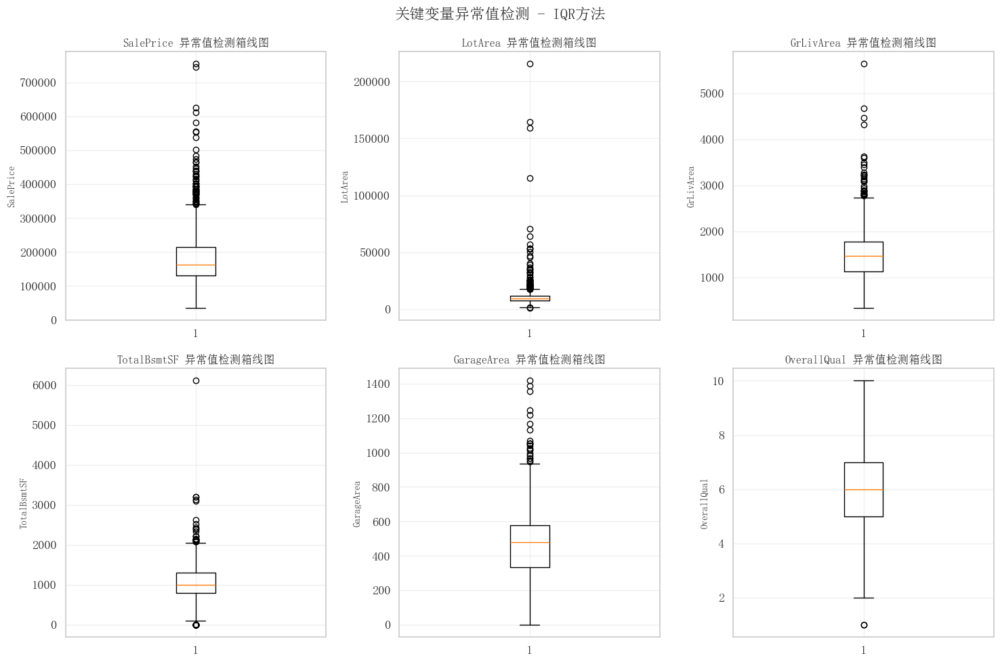
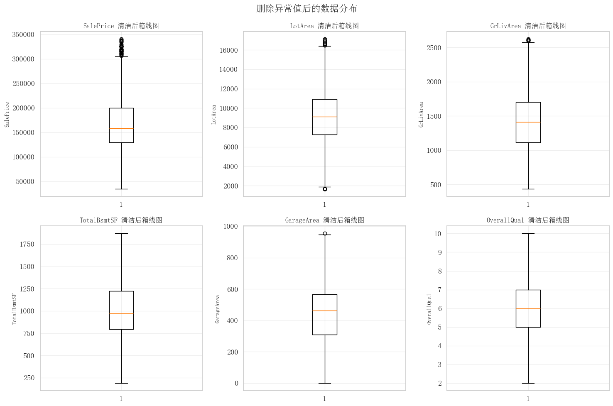
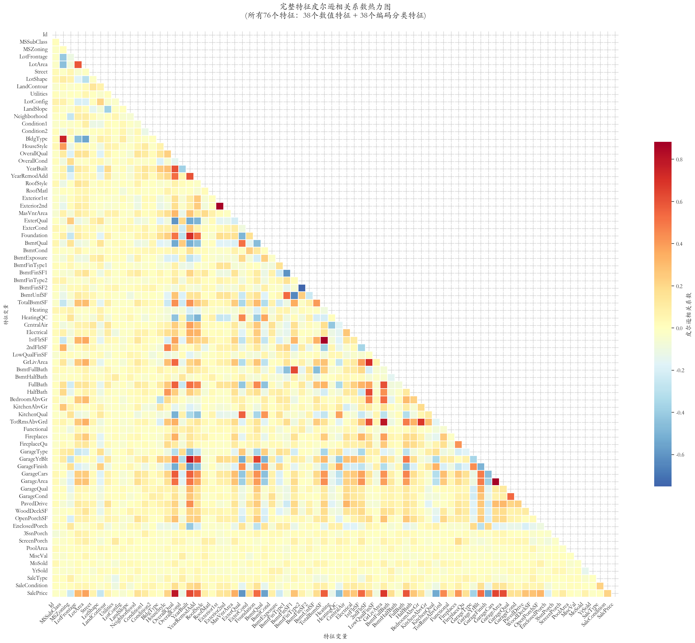
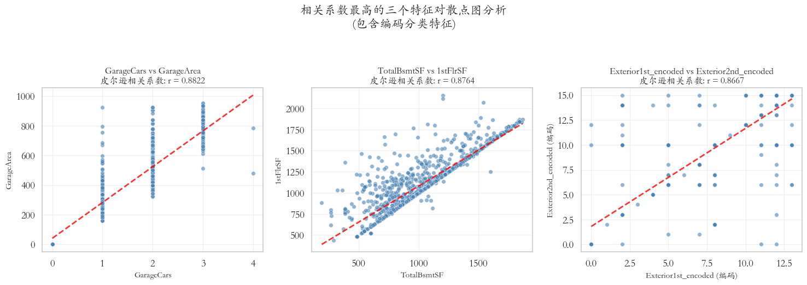
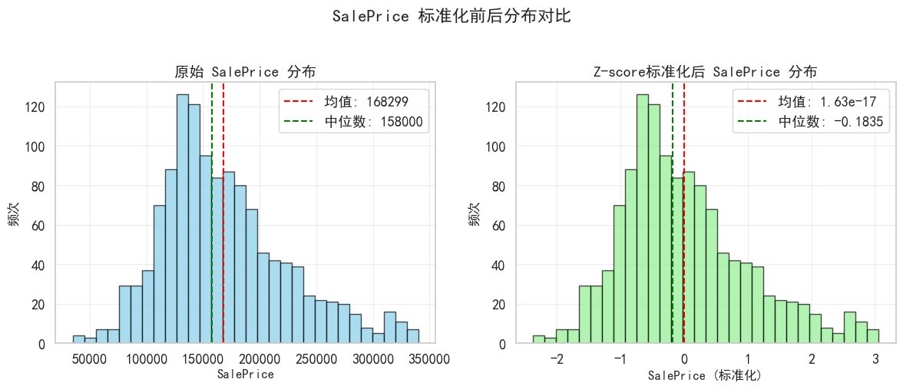
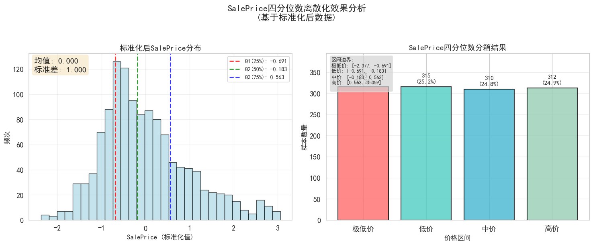

# 数据结构导论 - 第二次作业实验

## 实验题目：房屋价格数据分析与预处理

**实验日期：** 2025年9月22日

---

## 实验目的
理解数据分析的基本过程，掌握基本的数据预处理方法。

## 问题重述
【内容描述】利用给出的房屋价格数据集，进行以下任务：
1. 缺失值的检测与缺失值处理
2. 异常值检测
3. 特征间的相关性分析
4. 对price属性进行标准化
5. 根据price属性进行离散化
6. 找出与price（房价）相关性最高的三个特征，并给出合理的解释

## 实验环境
采用Python语言并利用Jupyter Notebook编程实现。
## 问题的解决
### 1.缺失值的检测与处理
首先统计NA值的出现情况如下表所示：
| 字段名        | 缺失数量 | 缺失比例(%) | 数据类型 |
| ------------- | -------- | ----------- | -------- |
| PoolQC        | 1453     | 99.520548   | object   |
| MiscFeature   | 1406     | 96.301370   | object   |
| Alley         | 1369     | 93.767123   | object   |
| Fence         | 1179     | 80.753425   | object   |
| MasVnrType    | 872      | 59.726027   | object   |
| FireplaceQu   | 690      | 47.260274   | object   |
| LotFrontage   | 259      | 17.739726   | float64  |
| GarageType    | 81       | 5.547945    | object   |
| GarageYrBlt   | 81       | 5.547945    | float64  |
| GarageFinish  | 81       | 5.547945    | object   |
| GarageQual    | 81       | 5.547945    | object   |
| GarageCond    | 81       | 5.547945    | object   |
| BsmtExposure  | 38       | 2.602740    | object   |
| BsmtFinType2  | 38       | 2.602740    | object   |
| BsmtQual      | 37       | 2.534247    | object   |
| BsmtCond      | 37       | 2.534247    | object   |
| BsmtFinType1  | 37       | 2.534247    | object   |
| MasVnrArea    | 8        | 0.547945    | float64  |
| Electrical    | 1        | 0.068493    | object   |

缺失值的处理策略如下：
1. 缺失比例过高（例如 > 50%）的特征，直接删除。
   缺失比例 > 50.0% 的特征 (5个):
  - Alley: 93.8% 缺失
  - MasVnrType: 59.7% 缺失
  - PoolQC: 99.5% 缺失
  - Fence: 80.8% 缺失
  - MiscFeature: 96.3% 缺失
2. 对于数值型特征，用中位数（median）填充，因为中位数对异常值不敏感。
-  数值型 LotFrontage: 用中位数 69.00 填充 259 个缺失值
- 数值型 MasVnrArea: 用中位数 0.00 填充 8 个缺失值
- 数值型 GarageYrBlt: 用中位数 1980.00 填充 81 个缺失值
3. 对于分类型（object）特征，用众数（mode）填充。
- 分类型 BsmtQual: 用众数 'TA' 填充 37 个缺失值
- 分类型 BsmtCond: 用众数 'TA' 填充 37 个缺失值
- 分类型 BsmtExposure: 用众数 'No' 填充 38 个缺失值
- 分类型 BsmtFinType1: 用众数 'Unf' 填充 37 个缺失值
- 分类型 BsmtFinType2: 用众数 'Unf' 填充 38 个缺失值
- 分类型 Electrical: 用众数 'SBrkr' 填充 1 个缺失值
- 分类型 FireplaceQu: 用众数 'Gd' 填充 690 个缺失值

### 2.缺失值的检测与处理
选取关键变量 'SalePrice', 'LotArea', 'GrLivArea', 'TotalBsmtSF', 'GarageArea', 'OverallQual'，我们采用 **四分位距（IQR）方法** 来识别和处理异常值。四分位距的定义为：

$$
\mathrm{IQR} = Q_3 - Q_1
$$

其中，$Q_1$ 和 $Q_3$ 分别表示第一与第三四分位数。根据 IQR 的性质，可以构造异常值判断区间：

$$
[\,Q_1 - 1.5 \times \mathrm{IQR},\; Q_3 + 1.5 \times \mathrm{IQR}\,]
$$

若观测值超出该区间，则视为异常点。在建模中，我们对检测出的异常点进行了适当处理（如剔除或替换），以保证后续建模结果的稳定性与可靠性。下图可简单观察出变量的离群值：

为了保证数据的特征，以及后续建模结果的普适性，决定删除这样的离群值。
删除数据情况如下：
1. SalePrice: 删除 61 个异常值
2. LotArea: 删除 73 个异常值
3. GrLivArea: 删除 19 个异常值
4. TotalBsmtSF: 删除 50 个异常值
5. GarageArea: 删除 4 个异常值
6. OverallQual: 删除 1 个异常值
   
删除前后的数据箱线图如下：

- 删除前：1460 行 × 81 列
- 删除后：1252 行 × 81 列
- 总共删除：208 行异常数据
- 数据保留率：85.75%
由图可知，通过 IQR 方法剔除异常值，减少噪声和极端点的干扰，使得数据更符合模型假设，提高模型拟合效果和预测的可靠性。

### 3.特征间的相关性分析
首先对于分类变量，要先转化成数值变量，全面考虑进行计算，调用 LabelEncoder 对分类变量进行编码，编码的对应关系见第二次作业\data\categorical_variable_mappings.md。

对于相关性分析，使用皮尔逊相关系数分析特征间的相关性，并绘制热力图进行可视化。这里采用 **皮尔逊相关系数（Pearson Correlation Coefficient）** 来衡量变量之间的线性相关性，其计算公式为：

$$
r = \frac{\sum_{i=1}^{n} (x_i - \bar{x})(y_i - \bar{y})}{\sqrt{\sum_{i=1}^{n} (x_i - \bar{x})^2} \cdot \sqrt{\sum_{i=1}^{n} (y_i - \bar{y})^2}}
$$

其中，$\bar{x}$、$\bar{y}$ 分别表示变量 $X$ 与 $Y$ 的均值。$r$ 的取值范围为 $[-1,1]$：

* 当 $r \to 1$ 时，表示强正相关；
* 当 $r \to -1$ 时，表示强负相关；
* 当 $r \approx 0$ 时，表示无线性相关。

本次分析对**所有76个特征**（包含38个原始数值特征和38个编码后的分类特征）进行了全面的皮尔逊相关性分析。通过LabelEncoder编码，使原本无法量化的分类变量能够参与数值相关性分析，确保了分析的完整性和包容性。

计算后得到的**完整相关系数热力图**展示了所有76个特征间的相关性关系，如下所示：

热力图采用红-蓝配色方案，红色表示正相关，蓝色表示负相关，颜色深度表示相关性强度。图中可以清晰地观察到所有数值特征和编码分类特征之间的相关性模式，同时相关系数最大的十对变量如下表所示：

| 序号 | 变量1                 | 变量2                 | 相关系数  | 特征类型               | 相关方向 |
|------|-----------------------|-----------------------|-----------|------------------------|----------|
| 1    | GarageCars            | GarageArea            | 0.8822    | 数值-数值              | 强正相关 |
| 2    | TotalBsmtSF           | 1stFlrSF              | 0.8764    | 数值-数值              | 强正相关 |
| 3    | Exterior1st_encoded   | Exterior2nd_encoded   | 0.8667    | 编码分类-编码分类      | 强正相关 |
| 4    | GrLivArea             | TotRmsAbvGrd          | 0.8031    | 数值-数值              | 强正相关 |
| 5    | OverallQual           | SalePrice             | 0.7946    | 数值-数值              | 强正相关 |
| 6    | YearBuilt             | GarageYrBlt           | 0.7812    | 数值-数值              | 强正相关 |
| 7    | MSSubClass            | BldgType_encoded      | 0.7539    | 数值-编码分类          | 强正相关 |
| 8    | BsmtFinSF2            | BsmtFinType2_encoded  | -0.7502   | 数值-编码分类          | 强负相关 |
| 9    | YearBuilt             | Foundation_encoded    | 0.7113    | 数值-编码分类          | 强正相关 |
| 10   | 2ndFlrSF              | GrLivArea             | 0.7089    | 数值-数值              | 强正相关 |

这里选取相关系数最高的三个特征对绘制散点图并分析：

左图（GarageCars vs GarageArea）：
GarageCars（车库可容纳车辆数）与 GarageArea（车库面积）的点集中分布在几条竖线附近，呈现出明显的 “随着车库可容纳车辆数增加，车库面积同步增大” 的趋势。相关系数 \(r = 0.8822\) 是三对中最高的，说明两者线性关联最紧密 —— 逻辑上也很直观：能停更多车的车库，面积往往更大。

中图（TotalBsmtSF vs 1stFlrSF）：
TotalBsmtSF（地下室总面积）与 1stFlrSF（一层面积）的散点呈 “从左下到右上” 的带状分布，线性趋势非常明显。相关系数 \(r = 0.8764\) 接近左图，反映出 “地下室面积大的房屋，一层面积通常也较大” 的规律，可能是因为房屋整体户型设计中，各层面积存在协调关系。

右图（Exterior1st_encoded vs Exterior2nd_encoded）：
这是对分类特征（房屋外部材质等）编码后的数据，散点显示出一定的线性趋势，皮尔逊相关系数\(r = 0.8667\)，表明编码后的两类外部特征也存在较强的正线性相关，可能是因为房屋外部材质设计中，部分材质存在协调关系。

### 4.对price属性进行标准化
常见的标准化方法有 Z-score 标准化和 Min-Max 标准化，对应的数学计算公式如下：
$x_{Z-score} = (x - \mu) / \sigma$
$x_{Min-MAx} = (x - x_{min}) / (x_{max} - x_{min})$
综合考虑以上两种方法，决定选择 Z-score 标准化，该方法有一下优势：
- 消除量纲影响：房价数据通常有很大的数值范围，Z-score 标准化可以消除这种量纲上的差异，使得不同特征在建模时具有可比性，这对于许多机器学习算法（如线性回归、支持向量机等）非常重要。
- 处理异常值：虽然 Min-Max 标准化也能处理数据，但它容易受到异常值的影响。Z-score 标准化对异常值不那么敏感，因为它是基于数据的整体均值和标准差来计算的。
对'SalePrice'元素进行标准化：标准化后的数据分布情况如下所示：

| 数据集       | 均值        | 标准差     | 最小值    | 最大值    |
|--------------|-------------|------------|-----------|-----------|
| 原始数据     | 168298.80   | 56154.05   | 34900.00  | 340000.00 |
| 标准化数据   | 1.70e-17    | 1.000400   | -2.3765   | 3.0589    |

由图可见，数据的分布形态相似，保留了原始特征不变，标准化效果好。

### 5.根据price属性进行离散化
本问中选择了**四分位数分箱**方法对price属性进行离散化，

四分位数分箱方法有以下的优越性
1. 基于统计学原理，具有很强的理论基础
2. 每个区间约包含25%的数据，分布均匀
3. 具有明确的统计意义和解释性
4. 对数据分布的适应性较好

得到的结果示意图如下：

四分位数计算结果：
  - Q1 (25%分位数)：-0.6912
  - Q2 (50%分位数，中位数)：-0.1835
  - Q3 (75%分位数)：0.5630
  - 数据范围：[-2.3765, 3.0589]

执行四分位数分箱：
  - 分箱边界：['-2.3765', '-0.6912', '-0.1835', '0.5630', '3.0589']
  - 分箱标签：['极低价', '低价', '中价', '高价']
  
由此可见，该方法有优异的分类效果，通过离散化，将连续的房价数值转换为4个有序的价格类别，便于房价等级分析和分类建模，基于统计分位数，具有明确的业务解释，每个类别包含相近数量的样本，保证分析的均衡性

### 6.找出与price（房价）相关性最高的三个特征，并给出合理的解释
类比第三问过程，求解得到的与房价（SalePrice）相关性最高的三个特征及对应解释如下：
#### 1. OverallQual（房屋整体质量）
- **相关系数：** r = 0.7946
- **数据含义：** 房屋整体材料和装修质量的评分（1-10分）
- **市场逻辑：** 质量是决定房屋价值的核心因素，直接关系到居住体验和投资价值
- **影响机制：**
  - 直接反映房屋的建造标准和装修水平
  - 高质量材料和工艺显著提升房屋价值
  - 购房者普遍愿意为高质量房屋支付溢价
  - 质量好的房屋维护成本低，使用寿命长

#### 2. GrLivArea（地上居住面积）
- **相关系数：** r = 0.6751
- **数据含义：** 房屋地上部分的总居住面积（平方英尺）
- **市场逻辑：** 面积是房地产价值的基础要素，购房者为额外空间支付边际价格
- **影响机制：**
  - 面积大小直接决定居住空间的舒适度
  - 更大面积意味着更多功能区域和储存空间
  - 面积是房屋定价的基础计算单位
  - 大面积房屋通常配置更好，档次更高

#### 3. GarageCars（车库容量）
- **相关系数：** r = 0.6428
- **数据含义：** 车库可停放的汽车数量
- **市场逻辑：** 车库配置体现生活品质和实用性，是现代家庭的重要需求
- **影响机制：**
  - 反映房屋的便利性和实用性配置
  - 车库提供车辆保护和额外储存空间
  - 多车位满足多车家庭需求
  - 车库是房屋价值的重要附加项

## 问题总结

本次房价数据分析实验，围绕数据预处理与特征分析六大核心问题展开，具体总结如下：

1. **缺失值处理**：通过统计缺失比例，合理删除高缺失特征，并采用中位数/众数填充剩余缺失值，有效提升数据质量。
2. **异常值检测与处理**：采用IQR方法识别并剔除异常值，显著减少噪声和极端点，保证数据分布合理性和模型稳定性。
3. **特征相关性分析**：对所有数值和编码后的分类变量进行皮尔逊相关性分析，热力图直观展示变量间关系，发现了强相关特征对。
4. **标准化与离散化**：对房价进行Z-score标准化和四分位数分箱离散化，消除量纲影响，便于后续建模和分层分析。
5. **核心特征解释**：找出与房价相关性最高的三个特征（房屋整体质量、地上居住面积、车库容量），并结合市场逻辑和影响机制进行详细解释。

**整体收获**：
- 掌握了数据清洗、特征工程、相关性分析等数据科学基础流程。
- 能够结合统计方法和业务逻辑，系统性地分析和解释数据结果。
- 形成了完整的数据处理与分析流水线，为后续建模和实际应用打下坚实基础。

本实验不仅提升了数据分析实战能力，也加深了对房价影响因素的理解，可以为后续深入研究和应用提供了有力支撑。
