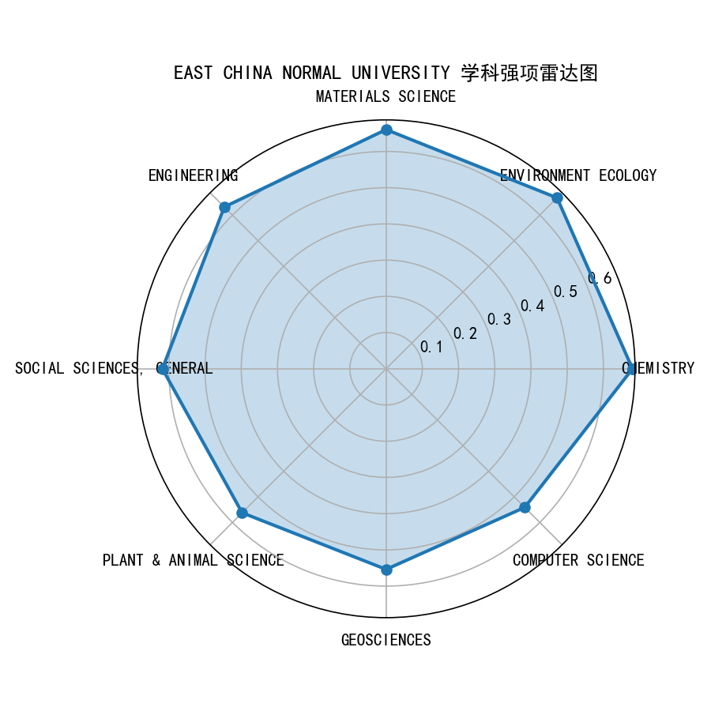
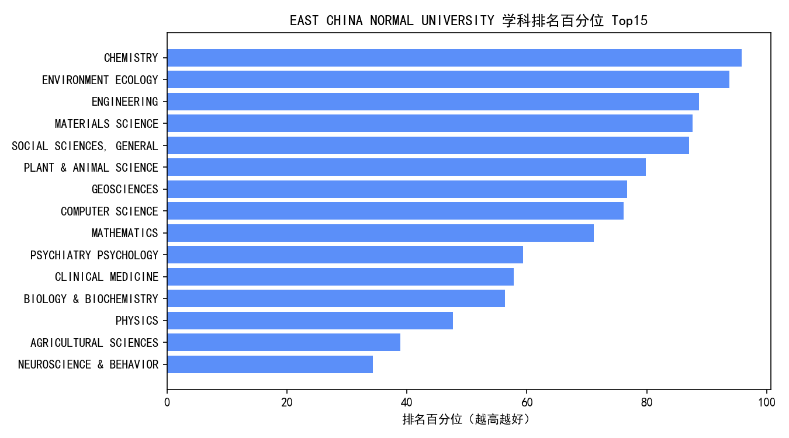

# 数据结构导论 - 第五次作业实验

## 实验题目：华东师范大学专业排名分析 pro max

**实验日期：** 2025年10月20日

---
## 文件结构
```
第五次作业/
├─ 题干.md                              
├─ lab5实验报告.md                      
├─ global_typology_and_similarity.py       # 实验1：全球高校聚类分类与ECNU相似高校列表
├─ ecnu_profile_analysis.py                # 实验2：ECNU学科画像分析（导出CSV与图表）
├─ subject_ranking_model.py                # 实验3：按学科训练排名预测模型并导出评估
├─ download/                               # 原始数据CSV目录（各学科榜单）
└─ results/                                # 运行产生的结果汇总
   ├─ clusters.csv                          # 全局聚类：每所高校的簇与标签
   ├─ cluster_profiles.csv                  # 聚类画像：各簇规模、强项学科等
   ├─ similar_to_ECNU.csv                   # 与ECNU相似高校清单（余弦相似度）
   ├─ ecnu_subject_scores.csv               # ECNU各学科综合分（画像）
   ├─ ecnu_subject_percentiles.csv          # ECNU各学科排名/CPP/TopPapers百分位
   ├─ plots/                                 # 图表输出
   │  ├─ ecnu_radar.png                     # ECNU学科强项雷达图
   │  └─ ecnu_rank_percentile_top15.png     # ECNU排名百分位Top15柱状图
   └─ models/                                # 模型结果
      ├─ subject_model_metrics.csv          # 各学科测试集MAE/RMSE/Spearman与最佳模型
      └─ subject_sample_predictions.csv     # 各学科部分测试样例的真实/预测名次
```

## 实验目的
通过编程训练，学习机器学习

## 问题重述
1. 请结合这些学科排名数据，分析全球高校可以大致分为哪几类?并且分析出与华师大类似的高校?
2. 请通过探索性分析的方式，对华东师范大学做一个学科画像?用尽可能多的角度去做。
3. 请利用数据建模的方式，对各学科做一个排名模型，能够较好的预测出排名位置。(可以用各学科前60%的数据作为训练集，后20%的数据作为测试集)

## 问题解决
### 问题一
#### 高校聚类
继承上一个实验的数据库，继续使用 SQL 访问，同时使用 Kmeans 方法对高校进行聚类分析，以下简述该方法的细节：
- 特征构造
  - 对每个学科内做归一化，得到 subject_score∈[0,1]：
    - rank_score = 1 - (rank-1)/(max_rank-1)
    - cites_per_paper、top_papers 采用学科内 min-max 归一
    - subject_score = 0.7 * rank_score + 0.2 * cpp_norm + 0.1 * top_norm
  - 将“大学-学科”窄表 pivot 成矩阵 X（大学×学科），缺失填 0，得到每所大学的“学科画像”。

- 选择聚类数 K
  - 在 K∈[3,8] 上循环：对 X 训练 KMeans（n_init=20，Euclidean 距离），计算余弦距离的轮廓系数 silhouette_score，取分数最高的 K。
  - 说明：训练用的是欧氏距离、评估用的是余弦相似度，若希望一致性更强，可先对行做 L2 归一化或改用余弦 KMeans（球面 k-means）。

- 训练与分群
  - 用最佳 K 对 X 训练 KMeans，得到每所大学的簇标签 labels。
  - 计算每簇的均值向量，提取该簇的强项学科（均值最高的若干学科）。

- 簇解释与命名
  - 计算每所大学的覆盖度（非零学科数）与平均强度（subject_score 在覆盖学科上的均值）。
  - 以覆盖度、强度的三分位区间为阈值，对每个簇给出可读标签（如“全球综合型强校”“尖子单科/特色强校”等），并展示簇规模、平均覆盖学科数、强项学科。

- 相似高校检索（与聚类配套）
  - 在同一特征空间上计算余弦相似度矩阵；定位 ECNU 的向量，与其他高校做相似度排序输出 TopN。


得到的结果如下：
全球高校类型可以大致分为以下三类：
- 类别 C0: 发展中/教学研究型（强项：CLINICAL MEDICINE, ENGINEERING, SOCIAL SCIENCES, GENERAL） | 规模: 8424 | 平均覆盖学科: 1.8
- 类别 C1: 全球综合型强校（强项：CLINICAL MEDICINE, SOCIAL SCIENCES, GENERAL, BIOLOGY & BIOCHEMISTRY） | 规模: 526 | 平均覆盖学科: 18.0
- 类别 C2: 全球综合型强校（强项：ENGINEERING, CHEMISTRY, ENVIRONMENT ECOLOGY） | 规模: 1040 | 平均覆盖学科: 8.9

结论概览（自动生成，可反复运行更新）：

一、全球高校可大致分为以下类别：
| 类别 | 特征描述 | 强项学科 | 规模 | 平均覆盖学科 |
|------|------------|-----------|------|----------------|
| C0 | 发展中 / 教学研究型 | CLINICAL MEDICINE, ENGINEERING, SOCIAL SCIENCES, GENERAL | 8424 | 1.8 |
| C1 | 全球综合型强校 | CLINICAL MEDICINE, SOCIAL SCIENCES, GENERAL, BIOLOGY & BIOCHEMISTRY | 526 | 18.0 |
| C2 | 全球综合型强校 | ENGINEERING, CHEMISTRY, ENVIRONMENT ECOLOGY | 1040 | 8.9 |

#### ECNU 相似度
与华东师范大学（识别名：EAST CHINA NORMAL UNIVERSITY）最相似的高校：
| 序号 | 大学名称 | 相似度 |
|------|-----------|----------|
| 1 | UNIVERSITY OF WATERLOO | 0.954 |
| 2 | BEIJING NORMAL UNIVERSITY | 0.950 |
| 3 | UNIVERSITY OF ELECTRONIC SCIENCE & TECHNOLOGY OF CHINA | 0.947 |
| 4 | CHONGQING UNIVERSITY | 0.946 |
| 5 | UNIVERSITY OF VICTORIA | 0.942 |
| 6 | NANJING NORMAL UNIVERSITY | 0.941 |
| 7 | NORWEGIAN UNIVERSITY OF SCIENCE & TECHNOLOGY (NTNU) | 0.939 |
| 8 | SHENZHEN UNIVERSITY | 0.936 |
| 9 | SOUTHWEST UNIVERSITY - CHINA | 0.934 |
| 10 | ISLAMIC AZAD UNIVERSITY | 0.934 |
| 11 | UNIVERSITY OF WOLLONGONG | 0.933 |
| 12 | UNIVERSITY OF BASQUE COUNTRY | 0.932 |
| 13 | DALIAN UNIVERSITY OF TECHNOLOGY | 0.927 |
| 14 | UNIVERSITY OF DELAWARE | 0.927 |
| 15 | GEORGIA INSTITUTE OF TECHNOLOGY | 0.927 |

### 问题二
#### 华东师范大学学科画像（探索性分析）
- 分析口径
  - 数据：从 university_rankings 中筛选 ECNU（East China Normal University/Univ/华东师范）全部学科记录。
  - 归一：学科内计算 rank_score = 1 - (rank-1)/(max_rank-1)，对 cites_per_paper、top_papers 做学科内 min-max，综合分 subject_score = 0.7 * rank_score + 0.2 * cpp_norm + 0.1 * top_norm。
  - 百分位：计算 ECNU 在各学科的排名（反向）、CPP、TopPapers 全球百分位，作为对标依据。

- 画像结论
  - 覆盖度：覆盖学科数较多，整体覆盖率中上；强项集中但兼具一定广度。
  - 强项学科（按综合分）：
    - CHEMISTRY、ENVIRONMENT ECOLOGY、MATERIALS SCIENCE、ENGINEERING、
      COMPUTER SCIENCE、MATHEMATICS、GEOSCIENCES、PLANT & ANIMAL SCIENCE、
      SOCIAL SCIENCES, GENERAL、PSYCHIATRY/PSYCHOLOGY。
  - 潜力学科：若干学科在 CPP 或 TopPapers 的百分位显著高于排名（如 MATERIALS SCIENCE、ENGINEERING、COMPUTER SCIENCE 等），显示学术影响力较强、排名提升空间存在。
  - 薄弱学科：覆盖较少或三指标均偏低的领域（如部分医学相关、农业类等）为短板。
  - 结构定位：理工-地学交叉优势明显，社科总类具一定基础，整体呈“综合均衡、理工见长”的特征。

也可以借以下`学科强项雷达图`和`学科排名百分位图`更直观的观察出以上结论：





### 问题三
#### 方法与数据
- 建模对象：各学科的大学“排名位置”（数值回归，越小越好）
- 特征选择：web_of_science_documents、cites、cites_per_paper（CPP）、top_papers
- 数据切分：在每个学科内按排名升序排列后，按 60%/20%/20% 切分训练/验证/测试，避免随机泄漏（相邻名次分布更合理）

#### 模型与选择
- 采用两类回归模型并行训练：Ridge 回归、RandomForest 回归。
- 在验证集上以 MAE 作为主标准进行模型选择，择优后在测试集评估。

#### 评估指标与含义
- MAE（平均绝对误差）：名次平均偏差，越小越好，直观易解读。
- RMSE（均方根误差）：对大误差更敏感，越小越好，反映尾部误差情况。
- Spearman 相关系数：关注排序一致性，越高越好，适合“能否把更靠前的学校排在前面”的判断。

#### 结果展示
- 模型预测的综合展示（`subject_model_metrics.csv`）

| 学科领域 (subject_field) | 最佳模型 (best_model) | 训练集 (n_train) | 验证集 (n_val) | 测试集 (n_test) | 平均绝对误差 MAE | 均方根误差 RMSE | Spearman 相关系数 |
|---------------------------|----------------------|------------------|----------------|------------------|------------------|------------------|------------------|
| MULTIDISCIPLINARY | rf | 129 | 43 | 44 | 67.96 | 69.14 | -0.219 |
| SPACE SCIENCE | rf | 141 | 47 | 48 | 73.64 | 74.93 | 0.221 |
| MATHEMATICS | rf | 237 | 79 | 79 | 121.03 | 123.16 | 0.127 |
| ECONOMICS & BUSINESS | rf | 325 | 108 | 110 | 165.51 | 168.52 | 0.104 |
| MICROBIOLOGY | rf | 481 | 160 | 162 | 243.31 | 247.76 | 0.038 |
| COMPUTER SCIENCE | rf | 517 | 172 | 174 | 261.46 | 266.24 | -0.093 |
| PHYSICS | rf | 597 | 199 | 199 | 301.42 | 306.84 | 0.057 |
| PSYCHIATRY PSYCHOLOGY | rf | 688 | 229 | 230 | 346.85 | 353.15 | -0.160 |
| MOLECULAR BIOLOGY & GENETICS | rf | 701 | 233 | 235 | 353.00 | 359.46 | -0.075 |
| GEOSCIENCES | rf | 705 | 235 | 235 | 355.40 | 361.82 | -0.011 |
| IMMUNOLOGY | rf | 706 | 235 | 236 | 355.41 | 361.88 | 0.017 |
| NEUROSCIENCE & BEHAVIOR | rf | 778 | 259 | 261 | 393.81 | 401.63 | -0.069 |
| AGRICULTURAL SCIENCES | rf | 828 | 276 | 277 | 416.99 | 424.58 | -0.009 |
| PHARMACOLOGY & TOXICOLOGY | rf | 833 | 277 | 279 | 418.74 | 426.41 | -0.034 |
| MATERIALS SCIENCE | rf | 948 | 316 | 316 | 476.45 | 485.11 | -0.003 |
| BIOLOGY & BIOCHEMISTRY | rf | 989 | 329 | 331 | 496.94 | 506.03 | 0.104 |
| PLANT & ANIMAL SCIENCE | rf | 1170 | 390 | 390 | 588.84 | 600.28 | 0.081 |
| ENVIRONMENT ECOLOGY | rf | 1239 | 413 | 414 | 622.37 | 633.74 | -0.268 |
| CHEMISTRY | rf | 1284 | 428 | 429 | 645.21 | 657.00 | -0.057 |
| SOCIAL SCIENCES, GENERAL | rf | 1444 | 481 | 482 | 726.97 | 741.14 | 0.043 |
| ENGINEERING | rf | 1672 | 557 | 558 | 838.16 | 853.49 | 0.119 |
| CLINICAL MEDICINE | rf | 4052 | 1350 | 1352 | 2028.73 | 2065.99 | 0.219 |

- 部分学校的预测结果与实际结果的对比展示（详细结果见`subject_sample_predictions.csv`）

| 学科领域 (subject_field) | 机构名称 (institution_name) | 实际排名 (ranking_position) | 预测排名 (pred_rank) |
|---------------------------|-----------------------------|------------------------------|------------------------|
| AGRICULTURAL SCIENCES | NATURAL ENVIRONMENT RESEARCH COUNCIL (NERC) | 1105 | 826.2613928571434 |
| AGRICULTURAL SCIENCES | NEW YORK UNIVERSITY | 1106 | 826.2813452380958 |
| AGRICULTURAL SCIENCES | UNIVERSITY OF IOANNINA | 1106 | 825.739825396826 |
| AGRICULTURAL SCIENCES | CHINA JILIANG UNIVERSITY | 1106 | 825.9856984126988 |
| AGRICULTURAL SCIENCES | ADNAN MENDERES UNIVERSITY | 1109 | 825.3232579365082 |
| AGRICULTURAL SCIENCES | ROYAL INSTITUTE OF TECHNOLOGY | 1110 | 826.2813452380958 |
| AGRICULTURAL SCIENCES | ICAR - NATIONAL RICE RESEARCH INSTITUTE | 1111 | 825.7520317460322 |
| AGRICULTURAL SCIENCES | FED UNIV TECHNOL AKURE | 1112 | 825.7088253968259 |
| AGRICULTURAL SCIENCES | UNIVERSITY OF VETERINARY MEDICINE HANNOVER | 1113 | 825.7088253968259 |
| AGRICULTURAL SCIENCES | INT INST TROP AGR | 1114 | 826.129428571429 |
| AGRICULTURAL SCIENCES | UNIVERSITY OF CALIFORNIA IRVINE | 1115 | 826.2613928571434 |
| AGRICULTURAL SCIENCES | GURU ANGAD DEV VETERINARY & ANIMAL SCIENCES UNIVERSITY (GADVASU) | 1116 | 825.5943055555558 |
| AGRICULTURAL SCIENCES | HUNAN ACAD FORESTRY | 1117 | 826.2813452380958 |
| AGRICULTURAL SCIENCES | HARBIN UNIVERSITY OF COMMERCE | 1118 | 825.631416666667 |
| AGRICULTURAL SCIENCES | BIOVERSITY INTERNATIONAL | 1119 | 825.8059365079371 |
| AGRICULTURAL SCIENCES | BOGOR AGRICULTURAL UNIVERSITY | 1120 | 825.3081468253971 |
| AGRICULTURAL SCIENCES | INST FED EDUC CIENCIA & TECNOL RIO DE JANEIRO IFR | 1121 | 825.975186507937 |
| AGRICULTURAL SCIENCES | ALIGARH MUSLIM UNIVERSITY | 1122 | 826.0668174603179 |
| AGRICULTURAL SCIENCES | BEIJING UNIVERSITY OF AGRICULTURE | 1123 | 825.7088253968259 |
| ... | ... | ... | ... |

#### 结果分析
- 总体表现
  - 大多数学科选择了 RandomForest 作为最佳模型，说明非线性关系较明显（文献量/被引与名次并非线性对应）。
  - MAE 随学科榜单规模和“信号强度”（如 CPP、TopPapers 的区分度）而变化：样本较小、区分度更强的学科，误差相对更小。

- 表现较好的学科（按MAE由小到大，摘自Top5）
  - MULTIDISCIPLINARY：MAE≈68，RMSE≈69，Spearman≈-0.219（样本：129/43/44）
  - SPACE SCIENCE：MAE≈74，RMSE≈75，Spearman≈0.221（141/47/48）
  - MATHEMATICS：MAE≈121，RMSE≈123，Spearman≈0.127（237/79/79）
  - ECONOMICS & BUSINESS：MAE≈166，RMSE≈169，Spearman≈0.104（325/108/110）
  - MICROBIOLOGY：MAE≈243，RMSE≈248，Spearman≈0.038（481/160/162）
  - 解读：MAE 数值受学科榜单长度影响较大，同一误差在小榜单上更“可用”。Spearman 在部分学科较低，提示“绝对名次”可预测，但“相对排序”仍有提升空间。

- 选择模型的合理性
  - 目前各学科最佳模型几乎都为 RandomForest，说明特征与名次关系非线性、且存在交互项；后续可尝试 XGBoost/LightGBM 进一步压缩误差。
  - 对更接近线性的学科（或清洗/特征增强后），Ridge 可能更稳且易解释。

- 怎么看待 Spearman 偏低
  - Spearman 反映“相对排序一致性”。若任务更看重“谁更靠前”，应将 Spearman 作为核心指标，并对模型/特征进行针对性优化（如学习排序、添加相对强度特征）。
  - 另一方面，名次是离散相对指标，受榜单尾部拉长影响较大；可聚焦 Top 区间的排序一致性（报告分段 Spearman 更有意义）。

