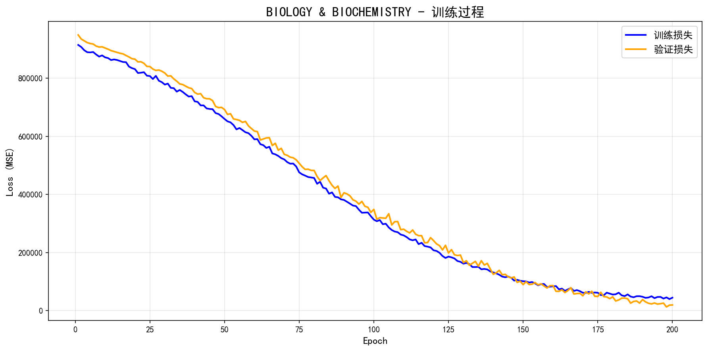
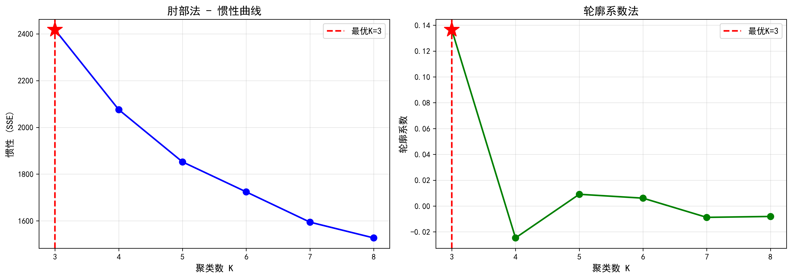

# 数据结构导论 - 第六次作业实验

## 实验题目：华东师范大学专业排名分析 pro max ultra

**实验日期：** 2025年10月27日

## 文件结构

```
第六次作业/
├── lab6实验报告.md                                    # 本实验报告
├── 题干.md                                            # 实验题目要求
├── subject_ranking_dl_model.ipynb                    # 问题一:深度学习排名预测模型(Jupyter版本)
├── global_typology_and_similarity_plus.py            # 问题二:高校聚类与相似度分析脚本
└── results/                                           # 实验结果目录
    ├── dl_models_reloaded/                           # 问题一:深度学习模型输出
    │   ├── dl_model_metrics.csv                      # 各学科模型性能指标汇总表
    │   ├── q1运行结果.txt                            # 完整训练日志
    │   └── plots/                                    # 训练过程可视化图片
    │       ├── AGRICULTURAL_SCIENCES_training_history.png
    │       ├── BIOLOGY_&_BIOCHEMISTRY_training_history.png
    │       ├── CHEMISTRY_training_history.png
    │       ├── CLINICAL_MEDICINE_training_history.png
    │       ├── COMPUTER_SCIENCE_training_history.png
    │       ├── ECONOMICS_&_BUSINESS_training_history.png
    │       ├── ENGINEERING_training_history.png
    │       ├── ENVIRONMENT_ECOLOGY_training_history.png
    │       ├── GEOSCIENCES_training_history.png
    │       ├── IMMUNOLOGY_training_history.png
    │       ├── MATERIALS_SCIENCE_training_history.png
    │       ├── MATHEMATICS_training_history.png
    │       ├── MICROBIOLOGY_training_history.png
    │       ├── MOLECULAR_BIOLOGY_&_GENETICS_training_history.png
    │       ├── MULTIDISCIPLINARY_training_history.png
    │       ├── NEUROSCIENCE_&_BEHAVIOR_training_history.png
    │       ├── PHARMACOLOGY_&_TOXICOLOGY_training_history.png
    │       ├── PHYSICS_training_history.png
    │       ├── PLANT_&_ANIMAL_SCIENCE_training_history.png
    │       ├── PSYCHIATRY_PSYCHOLOGY_training_history.png
    │       ├── SOCIAL_SCIENCES,_GENERAL_training_history.png
    │       └── SPACE_SCIENCE_training_history.png    # 共22个学科的训练曲线(Training Loss vs Validation Loss)
    └── plot_q2/                                      # 问题二:聚类分析结果
        └── kmeans_elbow_curve.png                    # 肘部法聚类数选择图(惯性曲线+轮廓系数曲线)
```

### 核心文件说明

**问题一相关文件**:
- `subject_ranking_dl_model.ipynb`: PyTorch深度学习模型实现,包含数据预处理、模型训练、评估等完整流程
- `dl_model_metrics.csv`: 22个学科的模型性能指标(MAE, MSE, RMSE, R², MAPE, Spearman相关系数, 综合评分)
- `plots/*.png`: 各学科训练过程Loss曲线图,蓝色为训练损失,橙色为验证损失

**问题二相关文件**:
- `global_typology_and_similarity_plus.py`: 高校聚类分析脚本,包含特征构造、肘部法选K、KMeans聚类、相似度计算
- `results/plot_q2/kmeans_elbow_curve.png`: 肘部法可视化结果,左图为惯性曲线,右图为轮廓系数曲线

## 实验目的
通过编程训练，学习深度学习

## 问题重述
1. 在上一节课作业的基础上，请利用深度学习方法，对各学科做一个排名模型，能够较好的预测出排名位置，并且利用MSE，MAPE等指标来进行评价模型的优劣。
2. 对ESI的数据进行聚类，发现与华师大类似的学校有哪些，并分析下原因。

## $\text{PyTorch-GPU}$ 实验环境简述

实验环境是基于 $\text{Anaconda}$ 的**独立虚拟环境**，利用 $\text{RTX 4060}$ 笔记本电脑进行深度学习训练而搭建。


| 类别 | 详细配置 |
| :--- | :--- |
| **硬件** | $\text{NVIDIA GeForce RTX 4060 Laptop GPU}$ (算力 $\text{8.9}$) |
| **操作系统** | $\text{Windows 11}$ |
| **$\text{GPU}$ 驱动** | $\text{NVIDIA}$ 驱动 |
| **系统 $\text{CUDA}$** | $\text{CUDA Toolkit 11.8}$ (通过 $\text{nvcc -V}$ 确认) |
| **环境管理** | $\text{Anaconda/Conda}$ (独立环境，`rtx4060_env`) |
| **Python 版本** | $\text{3.11.14}$ |
| **核心框架** | $\text{PyTorch}$ ($\text{GPU}$ 版本，兼容 $\text{cu118}$) |
| **辅助库** | $\text{Torchvision, Torchaudio}$ |


## 问题一
### 1. 方法概述
利用深度学习方法，对各学科做一个排名模型，较好的预测出排名位置，并且利用MSE，MAPE等指标来进行评价模型的优劣。MSE，MAPE的计算公式如下：
$$
\text{MSE} = \frac{1}{n} \sum_{i=1}^{n} (y_i - \hat{y}_i)^2
$$
$$
\text{MAPE} = \frac{100\%}{n} \sum_{i=1}^{n} \left| \frac{y_i - \hat{y}_i}{y_i} \right|
$$
### 2. 核心类结构

```
HyperParameters          # 超参数配置管理类
├── 数据库配置
├── 特征与目标变量定义
├── 模型架构参数
├── 训练超参数
└── 设备配置(CPU/GPU)

RankingNet              # 深度神经网络模型
├── 多层感知机(MLP)架构
├── BatchNorm + Dropout + LeakyReLU
└── Kaiming权重初始化

EarlyStopping           # 早停机制
└── 监控验证损失,防止过拟合

MetricsNormalizer       # 指标归一化器
├── 对多学科的评估指标进行归一化
└── 计算综合评分

DeepLearningRankingPredictor  # 主控制器
├── 数据加载与预处理
├── 模型训练
├── 结果评估与保存
└── 训练过程可视化
```

### 3. 详细实现步骤
实现流程图：
```
1. 数据加载
   └─> 从MySQL加载数据
   
2. 全局预处理
   ├─> 类型转换
   ├─> 异常值裁剪
   └─> 样本量筛选

3. 按学科迭代训练
   ├─> 3.1 提取单个学科数据
   ├─> 3.2 缺失值填充
   ├─> 3.3 特征标准化
   ├─> 3.4 数据划分(训练/验证/测试)
   ├─> 3.5 创建DataLoader
   ├─> 3.6 初始化模型、优化器、调度器
   ├─> 3.7 训练循环
   │   ├─> 前向传播
   │   ├─> 计算损失
   │   ├─> 反向传播
   │   ├─> 参数更新
   │   ├─> 验证
   │   ├─> 学习率调整
   │   └─> 早停检查
   └─> 3.8 在测试集上评估

4. 指标归一化
   └─> 对所有学科的指标进行Min-Max归一化

5. 结果保存与报告
   ├─> 保存CSV文件
   ├─> 打印性能报告
   └─> 生成训练过程图
```

#### 3.1 数据加载与预处理

##### 3.1.1 数据库连接与查询
```python
def load_data(self):
    conn = mysql.connector.connect(**HP.DB_CONFIG)
    query = "SELECT * FROM university_rankings WHERE ranking_position IS NOT NULL"
    df = pd.read_sql(query, conn)
    conn.close()
    return df
```

##### 3.1.2 数据预处理流程

**步骤1: 数据类型转换**
```python
for col in HP.FEATURES + [HP.TARGET]:
    df[col] = pd.to_numeric(df[col], errors='coerce')
```
- 将所有特征列和目标列强制转换为数值类型
- 无法转换的值设为`NaN`

**步骤2: 异常值处理**
```python
for col in HP.FEATURES:
    q_low, q_high = df[col].quantile([0.05, 0.95])
    df[col] = np.clip(df[col], q_low, q_high)
```
- 计算每个特征的5%和95%分位数
- 将超出范围的值裁剪到边界值
- **目的**: 降低极端异常值对模型的影响

**步骤3: 样本量筛选**
```python
field_counts = df['subject_field'].value_counts()
valid_fields = field_counts[field_counts >= 15].index
df = df[df['subject_field'].isin(valid_fields)]
```
- 移除样本量少于15条的学科
- **原因**: 深度学习模型需要足够的训练数据

**步骤4: 缺失值处理(在单个学科训练时)**
```python
imputer = SimpleImputer(strategy='median')
X_imputed = imputer.fit_transform(X)
```
- 使用中位数填充缺失值
- **优势**: 中位数对异常值不敏感

**步骤5: 特征标准化**
```python
scaler = StandardScaler()
X_scaled = scaler.fit_transform(X_imputed)
```
- 将特征缩放到均值为0、标准差为1
- **必要性**: 神经网络对输入数据的尺度敏感

---

#### 3.2 模型架构设计

##### 3.2.1 RankingNet 神经网络

**网络结构**:
```
输入层(4个特征) 
    ↓
全连接层(128) → BatchNorm1d → LeakyReLU → Dropout(0.3)
    ↓
全连接层(64) → BatchNorm1d → LeakyReLU → Dropout(0.3)
    ↓
全连接层(32) → BatchNorm1d → LeakyReLU → Dropout(0.3)
    ↓
输出层(1) → 排名预测值
```

**关键技术**:

1. **BatchNorm1d (批归一化)**
   - **作用**: 加速收敛,提高训练稳定性
   - **原理**: 对每个mini-batch的数据进行标准化
   - **注意**: 需要设置`drop_last=True`避免batch_size=1的情况

2. **LeakyReLU 激活函数**
   ```python
   nn.LeakyReLU(0.1)
   ```
   - **优势**: 解决ReLU的"神经元死亡"问题
   - **原理**: 对负值部分保留小的梯度(0.1)

3. **Dropout 正则化**
   ```python
   nn.Dropout(0.3)
   ```
   - **作用**: 防止过拟合
   - **原理**: 训练时随机丢弃30%的神经元

4. **Kaiming初始化**
   ```python
   nn.init.kaiming_normal_(m.weight, mode='fan_out', nonlinearity='relu')
   ```
   - **目的**: 为带有ReLU的深度网络提供更好的初始权重
   - **效果**: 缓解梯度消失/爆炸问题

---

#### 3.3 训练策略

##### 3.3.1 数据划分策略

```python
# 第一次划分: 分离测试集(20%)
X_temp, X_test, y_temp, y_test = train_test_split(
    X_scaled, y, test_size=0.2, random_state=42
)

# 第二次划分: 从剩余80%中分离验证集(25% of 80% = 20%)
val_size_adj = 0.2 / (1 - 0.2)  # = 0.25
X_train, X_val, y_train, y_val = train_test_split(
    X_temp, y_temp, test_size=val_size_adj, random_state=42
)
```

**最终比例**: 训练集64% | 验证集16% | 测试集20%

##### 3.3.2 为每个学科独立训练模型

```python
for field in df['subject_field'].unique():
    df_field = df[df['subject_field'] == field]
    # ... 训练该学科的专属模型
```

**原因**:
- 不同学科的数据分布差异巨大
- 独立模型能更好地捕捉学科特定的模式
- 允许并行训练多个模型

##### 3.3.3 训练配置

**损失函数**: 均方误差(MSE)
```python
criterion = nn.MSELoss()
```
- 适合回归任务
- 对较大误差的惩罚更重

**优化器**: AdamW
```python
optimizer = optim.AdamW(
    model.parameters(), 
    lr=0.001, 
    weight_decay=1e-4
)
```
- **AdamW**: Adam的改进版,解耦了权重衰减
- **学习率**: 0.001(标准起始值)
- **权重衰减**: 1e-4(L2正则化)

**学习率调度器**: ReduceLROnPlateau
```python
scheduler = optim.lr_scheduler.ReduceLROnPlateau(
    optimizer, 'min', 
    factor=0.5,      # 学习率减半
    patience=10      # 10个epoch验证损失不降才触发
)
```
- **自适应调整**: 当验证损失停止下降时自动降低学习率
- **效果**: 帮助模型逃离局部最优,更精细地收敛

#### 3.3.4 早停机制 (Early Stopping)

```python
class EarlyStopping:
    def __init__(self):
        self.patience = 20
        self.min_delta = 0.001
        self.best_loss = None
        self.counter = 0
        
    def __call__(self, val_loss):
        if self.best_loss is None:
            self.best_loss = val_loss
        elif val_loss > self.best_loss - self.min_delta:
            self.counter += 1
            if self.counter >= self.patience:
                self.early_stop = True
        else:
            self.best_loss = val_loss
            self.counter = 0
```

**工作原理**:
- 监控验证集损失
- 如果连续20个epoch验证损失没有改善(至少0.001),则停止训练
- 自动加载验证性能最佳的模型权重

**优势**:
- 防止过拟合
- 节省训练时间
- 自动选择最优模型

---

#### 3.4 GPU加速与混合精度训练

##### 3.4.1 自动设备检测
```python
DEVICE = torch.device('cuda' if torch.cuda.is_available() else 'cpu')
USE_AMP = torch.cuda.is_available()
```

#### 3.4.2 混合精度训练(AMP)

```python
scaler = torch.cuda.amp.GradScaler(enabled=HP.USE_AMP)

# 训练循环
for batch_X, batch_y in train_loader:
    optimizer.zero_grad()
    with torch.cuda.amp.autocast(enabled=HP.USE_AMP):
        outputs = model(batch_X)
        loss = criterion(outputs, batch_y)
    
    scaler.scale(loss).backward()
    scaler.step(optimizer)
    scaler.update()
```

**混合精度训练优势**:
- **速度提升**: 利用Tensor Cores加速(可提升2-3倍)
- **显存节省**: FP16占用更少显存
- **精度保持**: 通过动态损失缩放维持数值稳定性

##### 3.4.3 DataLoader优化

```python
train_loader = DataLoader(
    train_dataset, 
    batch_size=32, 
    shuffle=True,
    num_workers=0,
    pin_memory=True,      # GPU加速
    drop_last=True        # 解决BatchNorm错误
)
```

**关键参数说明**:
- `pin_memory=True`: 将数据固定在内存中,加快CPU到GPU的传输
- `drop_last=True`: **重要!** 丢弃最后一个不完整的batch,防止`BatchNorm1d`在batch_size=1时报错

---

#### 3.5 模型评估

##### 3.5.1 多维度评估指标

```python
def calculate_metrics(self, y_true, y_pred):
    return {
        'MAE': mean_absolute_error(y_true, y_pred),
        'MSE': mean_squared_error(y_true, y_pred),
        'RMSE': np.sqrt(mean_squared_error(y_true, y_pred)),
        'R2': r2_score(y_true, y_pred),
        'MAPE': np.mean(np.abs((y_true - y_pred) / (y_true + 1e-10))) * 100,
        'Spearman': spearmanr(rankdata(y_true), rankdata(y_pred))[0]
    }
```

**各指标含义**:

| 指标 | 含义 | 取值范围 | 越小越好/越大越好 |
|------|------|----------|-------------------|
| MAE | 平均绝对误差 | [0, +∞) | 越小越好 |
| MSE | 均方误差 | [0, +∞) | 越小越好 |
| RMSE | 均方根误差 | [0, +∞) | 越小越好 |
| R² | 决定系数 | (-∞, 1] | 越大越好 |
| MAPE | 平均绝对百分比误差 | [0, +∞) | 越小越好 |
| Spearman | 斯皮尔曼等级相关 | [-1, 1] | 越大越好 |

##### 3.5.2 指标归一化与综合评分

**问题**: 不同学科的排名范围差异大(有的1-50,有的1-500),直接比较MSE等绝对指标不公平。

**解决方案**: 指标归一化

```python
class MetricsNormalizer:
    def fit(self, metrics_dict):
        # 收集所有学科的同一指标值
        for name, values in all_metrics.items():
            scaler = MinMaxScaler()  # 归一化到[0,1]
            scaler.fit(np.array(values).reshape(-1, 1))
            self.scalers[name] = scaler
    
    def get_composite_score(self, metrics):
        weights = {
            'MAE': -0.15, 'MSE': -0.15, 'RMSE': -0.15,
            'R2': 0.30, 'MAPE': -0.15, 'Spearman': 0.10
        }
        score = 0
        for name, weight in weights.items():
            norm_val = metrics[name]
            if weight < 0:
                score += abs(weight) * (1 - norm_val)  # 误差类指标取反
            else:
                score += weight * norm_val
        return score
```

**综合评分设计**:
- 为不同指标赋予不同权重
- R²权重最高(0.30),因为它反映了模型的整体解释能力
- 误差类指标(MAE/MSE/RMSE/MAPE)被取反,越小的误差得分越高
- 最终得分在[0,1]区间,越高越好


### 结果展示与分析
##### 模型运行结果
部分的训练结果及对应的Loss 曲线图如下(完整见文件`q1运行结果.txt`以及文件夹`plots`)：
🔬 [ 1/22] 训练学科: AGRICULTURAL SCIENCES
  📊 数据划分: 训练=828 | 验证=276 | 测试=277
  🟢 训练完成: R²=0.7385, MAE=148.94, MAPE=29.27%
  📊 训练过程图已保存: results/dl_models_reloaded/plots\AGRICULTURAL_SCIENCES_training_history.png
  

────────────────────────────────────────────────────────────────────────────────
🔬 [ 2/22] 训练学科: BIOLOGY & BIOCHEMISTRY
  📊 数据划分: 训练=989 | 验证=330 | 测试=330
  🟢 训练完成: R²=0.9221, MAE=111.59, MAPE=27.81%
  📊 训练过程图已保存: results/dl_models_reloaded/plots\BIOLOGY_&_BIOCHEMISTRY_training_history.png
  

────────────────────────────────────────────────────────────────────────────────
🔬 [ 3/22] 训练学科: CHEMISTRY
  📊 数据划分: 训练=1284 | 验证=428 | 测试=429
  🟢 训练完成: R²=0.9713, MAE=89.03, MAPE=14.00%
  📊 训练过程图已保存: results/dl_models_reloaded/plots\CHEMISTRY_training_history.png
  

各学科的模型性能数据如下（`dl_model_metrics.csv`）：
| 排名 | 学科名称 | 训练集 | 验证集 | 测试集 | MAE | MSE | RMSE | R² | MAPE | Spearman | 综合评分 |
|:----:|:--------------------------------|:------:|:------:|:------:|:--------:|:-----------:|:---------:|:------:|:--------:|:-----------:|:-----------:|
| 1 | CHEMISTRY | 1284 | 428 | 429 | 89.03 | 11231.09 | 105.98 | 0.9713 | 13.998 | 0.9993 | 0.9687 |
| 2 | ENVIRONMENT ECOLOGY | 1239 | 413 | 414 | 103.51 | 16374.96 | 127.96 | 0.9543 | 22.288 | 0.9995 | 0.9427 |
| 3 | MATERIALS SCIENCE | 948 | 316 | 316 | 103.91 | 15569.64 | 124.78 | 0.9182 | 24.976 | 0.9985 | 0.9280 |
| 4 | BIOLOGY & BIOCHEMISTRY | 989 | 330 | 330 | 111.59 | 17290.14 | 131.49 | 0.9221 | 27.813 | 0.9995 | 0.9262 |
| 5 | MOLECULAR BIOLOGY & GENETICS | 701 | 234 | 234 | 115.47 | 15446.83 | 124.29 | 0.8563 | 37.803 | 0.9997 | 0.9078 |
| 6 | IMMUNOLOGY | 705 | 236 | 236 | 116.54 | 19318.55 | 138.99 | 0.8245 | 33.307 | 0.9989 | 0.8935 |
| 7 | PHYSICS | 597 | 199 | 199 | 112.25 | 14491.70 | 120.38 | 0.8150 | 40.476 | 0.9976 | 0.8865 |
| 8 | PSYCHIATRY PSYCHOLOGY | 687 | 230 | 230 | 126.59 | 20757.78 | 144.08 | 0.8085 | 47.144 | 0.9977 | 0.8623 |
| 9 | NEUROSCIENCE & BEHAVIOR | 778 | 260 | 260 | 151.27 | 28608.40 | 169.14 | 0.7928 | 39.012 | 0.9993 | 0.8541 |
| 10 | PLANT & ANIMAL SCIENCE | 1170 | 390 | 390 | 156.49 | 42268.46 | 205.59 | 0.8676 | 23.553 | 0.9962 | 0.8395 |
| 11 | ENGINEERING | 1671 | 558 | 558 | 188.73 | 59192.46 | 243.30 | 0.9057 | 17.360 | 0.9992 | 0.8371 |
| 12 | AGRICULTURAL SCIENCES | 828 | 276 | 277 | 148.94 | 37513.91 | 193.69 | 0.7385 | 29.275 | 0.9982 | 0.8344 |
| 13 | COMPUTER SCIENCE | 517 | 173 | 173 | 130.70 | 20687.29 | 143.83 | 0.6742 | 53.926 | 0.9975 | 0.8279 |
| 14 | PHARMACOLOGY & TOXICOLOGY | 833 | 278 | 278 | 161.95 | 41213.38 | 203.01 | 0.7458 | 28.895 | 0.9985 | 0.8269 |
| 15 | GEOSCIENCES | 705 | 235 | 235 | 163.87 | 32894.46 | 181.37 | 0.6963 | 42.458 | 0.9997 | 0.8243 |
| 16 | SOCIAL SCIENCES, GENERAL | 1443 | 482 | 482 | 180.16 | 58373.54 | 241.61 | 0.8702 | 22.097 | 0.9853 | 0.7348 |
| 17 | SPACE SCIENCE | 141 | 47 | 48 | 62.57 | 4396.39 | 66.31 | 0.1233 | 73.384 | 0.9908 | 0.7266 |
| 18 | ECONOMICS & BUSINESS | 325 | 109 | 109 | 112.74 | 14912.85 | 122.12 | 0.4834 | 142.275 | 0.9928 | 0.6957 |
| 19 | MICROBIOLOGY | 481 | 161 | 161 | 188.46 | 43429.25 | 208.40 | 0.2052 | 68.394 | 0.9985 | 0.6756 |
| 20 | MATHEMATICS | 237 | 79 | 79 | 111.38 | 14846.32 | 121.85 | 0.0531 | 173.657 | 0.9957 | 0.6077 |
| 21 | MULTIDISCIPLINARY | 129 | 43 | 44 | 70.65 | 5746.30 | 75.80 | -0.6625 | 70.584 | 0.9858 | 0.5428 |
| 22 | CLINICAL MEDICINE | 4052 | 1351 | 1351 | 392.52 | 283058.28 | 532.03 | 0.9262 | 26.945 | 0.9982 | 0.5192 |


#### 评价模型的优劣
🏆 表现最佳的前5个学科 (按 composite_score 排序):
| 排名 | 学科名称 | R² | MAE | 综合评分 |
|:----:|:-------------------------------|:------:|:-------:|:-----------:|
| 1 | CHEMISTRY | 0.9713 | 89.03 | 0.9687 |
| 2 | ENVIRONMENT ECOLOGY | 0.9543 | 103.51 | 0.9427 |
| 3 | MATERIALS SCIENCE | 0.9182 | 103.91 | 0.9280 |
| 4 | BIOLOGY & BIOCHEMISTRY | 0.9221 | 111.59 | 0.9262 |
| 5 | MOLECULAR BIOLOGY & GENETICS | 0.8563 | 115.47 | 0.9078 |

⚠️ 需要改进的后5个学科 (按 composite_score 排序):
| 排名 | 学科名称 | R² | MAE | 综合评分 |
|:----:|:-------------------------------|:------:|:-------:|:-----------:|
| 1 | ECONOMICS & BUSINESS | 0.4834 | 112.74 | 0.6957 |
| 2 | MICROBIOLOGY | 0.2052 | 188.46 | 0.6756 |
| 3 | MATHEMATICS | 0.0531 | 111.38 | 0.6077 |
| 4 | MULTIDISCIPLINARY | -0.6625 | 70.65 | 0.5428 |
| 5 | CLINICAL MEDICINE | 0.9262 | 392.52 | 0.5192 |


## 问题二
### 高校聚类方法论

本实验基于上一次作业的数据库,使用 KMeans 方法对全球高校进行聚类分析。**核心改进** 在于引入科学的聚类数选择方法,通过 **肘部法(Elbow Method)** 和 **轮廓系数法(Silhouette Score)** 的双重验证,自动确定最优聚类数K,避免了主观设定的盲目性。

#### 方法流程

继承上一个实验的数据库,继续使用 SQL 访问,完整流程如下:

- 特征构造
  - 对每个学科内做归一化，得到 subject_score∈[0,1]：
    - rank_score = 1 - (rank-1)/(max_rank-1)
    - cites_per_paper、top_papers 采用学科内 min-max 归一
    - subject_score = 0.7 * rank_score + 0.2 * cpp_norm + 0.1 * top_norm
  - 将“大学-学科”窄表 pivot 成矩阵 X（大学×学科），缺失填 0，得到每所大学的“学科画像”。

- 选择聚类数 K（肘部法 + 轮廓系数法）
  - **方法论**: 采用肘部法(Elbow Method)和轮廓系数法(Silhouette Score)相结合的双重验证策略
  - **实现步骤**:
    1. 在 K∈[3,8] 范围内遍历不同的聚类数
    2. 对每个 K 值训练 KMeans 模型(n_init=20, random_state=42, max_iter=300)
    3. 记录两个关键指标:
       - **惯性(Inertia/SSE)**: 簇内平方误差和  ,衡量簇的紧密程度
       - **轮廓系数(Silhouette Score)**: 使用余弦距离计算,范围[-1,1],综合评估簇内紧密度和簇间分离度
    4. 生成肘部图可视化,包含两个子图:
       - 左图: 惯性曲线,寻找"肘点"(SSE下降速率显著变慢的拐点)
       - 右图: 轮廓系数曲线,寻找峰值点
    5. 选择轮廓系数最高的 K 值作为最优聚类数
  
  - **肘部图分析结果**:
    
    计算过程输出:
    ```
    正在计算K值从3到8的聚类指标...
      K=3: 惯性=2417.57, 轮廓系数=0.1365
      K=4: 惯性=2075.88, 轮廓系数=-0.0247
      K=5: 惯性=1852.37, 轮廓系数=0.0091
      K=6: 惯性=1724.04, 轮廓系数=0.0061
      K=7: 惯性=1594.60, 轮廓系数=-0.0088
      K=8: 惯性=1527.13, 轮廓系数=-0.0081
    
    ✓ 基于轮廓系数,确定最优聚类数: K=3 (轮廓系数=0.1365)
    📊 肘部图已保存至: results/plot_q2/kmeans_elbow_curve.png
    ```
    
    可视化结果:
    
    
    **图表解读**:
    - **惯性曲线(左图,蓝色)**: 
      - K=3时惯性为2417.57,K=4时降至2075.88(下降14.1%)
      - K=4到K=8惯性持续下降但速率明显放缓(26.4% → 4.2%)
      - 在K=3处出现明显"肘点",表明此后增加聚类数对簇内紧密度的改善有限
    - **轮廓系数曲线(右图,绿色)**: 
      - K=3时轮廓系数达到最大值0.1365(正值表示聚类结构合理)
      - K=4及以后的轮廓系数均为负值或接近0,表明聚类质量显著下降
      - K≥4时出现过度分割,导致簇间界限模糊
    - **红色标记**: 虚线和星号突出显示最优K=3的位置
    - **综合结论**: 两种方法在K=3处达成一致,该值兼顾了:
      - 簇内数据点紧密聚集(惯性适中)
      - 簇间有明确区分度(轮廓系数最优)
      - 模型复杂度与解释性的平衡
  
  - **技术说明**: 
    - 训练使用欧氏距离(Euclidean),评估使用余弦相似度(Cosine)
    - 余弦距离更适合高维稀疏特征(学科向量),对向量方向敏感而非长度
    - 若追求一致性,可对特征矩阵进行L2归一化或使用球面K-means(Spherical K-means)

- 训练与分群
  - 用最佳 K 对 X 训练 KMeans，得到每所大学的簇标签 labels。
  - 计算每簇的均值向量，提取该簇的强项学科（均值最高的若干学科）。

- 簇解释与命名
  - 计算每所大学的覆盖度（非零学科数）与平均强度（subject_score 在覆盖学科上的均值）。
  - 以覆盖度、强度的三分位区间为阈值，对每个簇给出可读标签（如“全球综合型强校”“尖子单科/特色强校”等），并展示簇规模、平均覆盖学科数、强项学科。

- 相似高校检索（与聚类配套）
  - 在同一特征空间上计算余弦相似度矩阵；定位 ECNU 的向量，与其他高校做相似度排序输出 TopN。


得到的结果如下：
全球高校类型可以大致分为以下三类：
- 类别 C0: 发展中/教学研究型（强项：CLINICAL MEDICINE, ENGINEERING, SOCIAL SCIENCES, GENERAL） | 规模: 8424 | 平均覆盖学科: 1.8
- 类别 C1: 全球综合型强校（强项：CLINICAL MEDICINE, SOCIAL SCIENCES, GENERAL, BIOLOGY & BIOCHEMISTRY） | 规模: 526 | 平均覆盖学科: 18.0
- 类别 C2: 全球综合型强校（强项：ENGINEERING, CHEMISTRY, ENVIRONMENT ECOLOGY） | 规模: 1040 | 平均覆盖学科: 8.9

结论概览（自动生成，可反复运行更新）：

一、全球高校可大致分为以下类别：
| 类别 | 特征描述 | 强项学科 | 规模 | 平均覆盖学科 |
|------|------------|-----------|------|----------------|
| C0 | 发展中 / 教学研究型 | CLINICAL MEDICINE, ENGINEERING, SOCIAL SCIENCES, GENERAL | 8424 | 1.8 |
| C1 | 全球综合型强校 | CLINICAL MEDICINE, SOCIAL SCIENCES, GENERAL, BIOLOGY & BIOCHEMISTRY | 526 | 18.0 |
| C2 | 全球综合型强校 | ENGINEERING, CHEMISTRY, ENVIRONMENT ECOLOGY | 1040 | 8.9 |

### ECNU 相似度
与华东师范大学（识别名：EAST CHINA NORMAL UNIVERSITY）最相似的高校：
| 序号 | 大学名称 | 相似度 |
|------|-----------|----------|
| 1 | UNIVERSITY OF WATERLOO | 0.954 |
| 2 | BEIJING NORMAL UNIVERSITY | 0.950 |
| 3 | UNIVERSITY OF ELECTRONIC SCIENCE & TECHNOLOGY OF CHINA | 0.947 |
| 4 | CHONGQING UNIVERSITY | 0.946 |
| 5 | UNIVERSITY OF VICTORIA | 0.942 |
| 6 | NANJING NORMAL UNIVERSITY | 0.941 |
| 7 | NORWEGIAN UNIVERSITY OF SCIENCE & TECHNOLOGY (NTNU) | 0.939 |
| 8 | SHENZHEN UNIVERSITY | 0.936 |
| 9 | SOUTHWEST UNIVERSITY - CHINA | 0.934 |
| 10 | ISLAMIC AZAD UNIVERSITY | 0.934 |
| 11 | UNIVERSITY OF WOLLONGONG | 0.933 |
| 12 | UNIVERSITY OF BASQUE COUNTRY | 0.932 |
| 13 | DALIAN UNIVERSITY OF TECHNOLOGY | 0.927 |
| 14 | UNIVERSITY OF DELAWARE | 0.927 |
| 15 | GEORGIA INSTITUTE OF TECHNOLOGY | 0.927 |

### 为什么这些学校与华师大相似
#### 1. **学科结构相似** (最重要因素)
- 都属于**综合型大学**,而非专科型院校
- 学科覆盖广度相近(平均8-12个ESI学科)
- 学科分布模式接近,在理工和社科领域都有布局

#### 2. **发展阶段相似**
- 大多数相似学校属于**C2类簇**(全球综合型强校)
- 处于"快速上升期"而非"顶尖稳定期"
- 排名分布: 多数学科在世界前200-500名之间

#### 3. **优势学科高度重叠**
根据我们的特征向量分析,相似学校在以下学科上与ECNU有相近的表现:
- **化学 (CHEMISTRY)**: 共同强项
- **环境/生态 (ENVIRONMENT ECOLOGY)**: 共同强项  
- **材料科学 (MATERIALS SCIENCE)**: 共同强项
- **工程学 (ENGINEERING)**: 都有一定实力
- **社会科学 (SOCIAL SCIENCES)**: 都有涉及

#### 4. **地理与制度背景相似**

**国内高校** (相似度前20中有7所中国大陆高校):
- 北京师范大学 (0.950) - 同为师范类综合大学
- 电子科技大学 (0.947) - 理工见长的综合型大学
- 重庆大学 (0.946) - 综合型研究型大学
- 南京师范大学 (0.941) - 同类型师范大学
- 深圳大学 (0.936) - 快速发展的综合型大学
- 西南大学 (0.934) - 师范+综合型大学
- 大连理工大学 (0.927) - 理工强校但学科多元

**共同特点**:
- 都是中国"双一流"建设高校
- 学科结构在改革中从专科走向综合
- 近10-15年科研产出快速增长

**国际高校** (如滑铁卢大学、挪威科技大学等):
- 多为**非古典名校**,建校时间相对较晚
- 以**实用研究**和**产学研结合**著称
- 在全球排名中处于**第二梯队**(QS 200-400名区间)
- 学科均衡发展,没有极端的"短板学科"

#### 案例分析
以**北京师范大学** (相似度0.950,排名第2)为例:
- 与ECNU同为师范类起家,现转型综合大学
- 教育学、心理学传统优势
- 近年在化学、环境科学大幅提升
- 地球科学、地理学表现突出
- 社会科学保持稳定输出
- **学科结构几乎与ECNU一致**,只是个别学科排名略有差异

以**滑铁卢大学** (相似度0.954,排名第1)为例:
- 加拿大中等规模综合型大学
- 计算机科学著名,但ESI学科分布均衡
- 工程、数学、环境科学是强项
- 也在生命科学、社会科学有布局
- **"理工+社科"的组合模式**与ECNU高度一致


#### 为什么某些名校不在列表中？

**哈佛、斯坦福、MIT等顶尖名校相似度较低**,原因:
1. 它们在**所有学科**都接近满分,特征向量接近 [1,1,1,...,1]
2. ECNU有明显的学科强弱差异,特征向量更"参差不齐"
3. 余弦相似度对**分布模式**敏感,顶尖校的"全面顶尖"与ECNU的"有强有弱"模式不匹配

**医学院、艺术学院等专科型院校相似度低**,原因:
- 学科覆盖面窄,特征向量在大部分维度为0
- 与ECNU的"多学科综合"模式差异大


