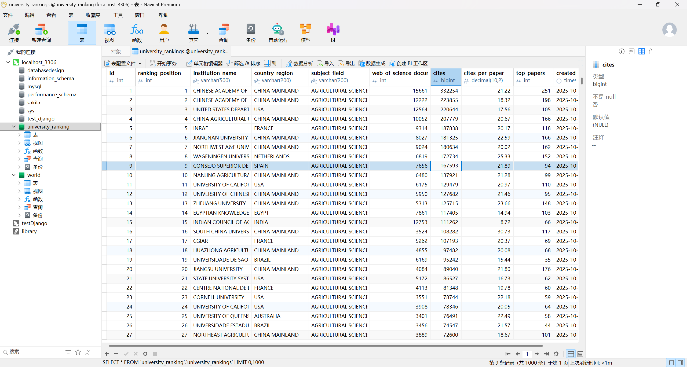
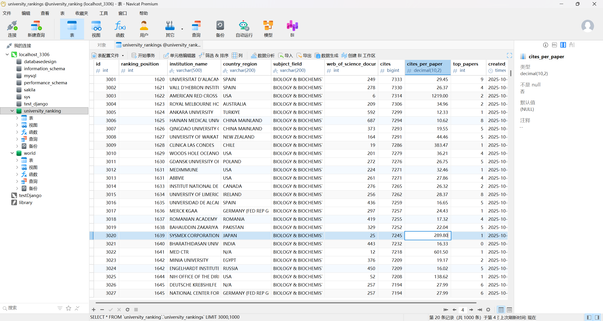

# 数据结构导论 - 第四次作业实验

## 实验题目：华东师范大学专业排名分析 pro

**实验日期：** 2025年10月13日

---

## 实验目的
通过编程训练，锻炼数据库能力

## 问题重述
1. 将获取的数据导入到一个关系型数据库系统中（系统可以自选）
2. 优化关系型数据，并整理一个合理的schema
3. 通过写SQL语句，获取华东师范大学在各个学科中的排名
4. 通过写SQL语句，获取中国（大陆地区）大学在各个学科中的表现
5. 通过写SQL语句，分析全球不同区域在各个学科中的表现


## 文件功能
- **`import_data_fixed.py`** - 数据导入脚本
  - 功能：将CSV数据批量导入MySQL数据库
  - 特点：自动检测编码，处理数据清洗，创建数据库表结构

- **`optimize_schema.py`** - 数据库Schema优化脚本
  - 功能：将原始单表结构规范化为4表关联结构
  - 优化：减少数据冗余，提高查询效率，符合数据库设计规范

- **`query_ecnu_rankings.py`** - 华东师范大学排名查询
  - 功能：查询华东师范大学在各个学科中的具体排名
  - 输出：生成详细的排名表格和统计信息

- **`china_mainland_analysis.py`** - 中国大陆大学表现分析
  - 功能：分析中国大陆大学在各学科的百分位表现
  - 特色：计算TOP10%/25%/50%占比，排名百分位分析

- **`global_regional_analysis.py`** - 全球区域表现分析
  - 功能：多维度分析全球不同区域在各学科的竞争格局
  - 特点：区域对比、学科分布、竞争力排名

- **`schema_analysis.py`** - Schema分析工具
  - 功能：分析原始数据的重复率和存储优化空间

### SQL查询文件
- **`ecnu_ranking_queries.sql`** - 华师大相关SQL查询
- **`china_mainland_performance_queries.sql`** - 中国大陆分析SQL查询  
- **`global_regional_analysis_queries.sql`** - 全球区域分析SQL查询

## 问题解决
### 第一问
选择 Mysql 关系型数据库系统，通过import_data_fixed.py 导入，结果的部分结果截图如下：





### 第二问
#### 原始数据库Schema分析
- 单表设计，所有数据存储在一个表中
- 大量数据重复：机构名称重复率70.7%，国家重复率99.6%，学科重复率99.9%
- 存储空间浪费严重
- 数据维护困难
1. 当前表结构:
   id - int - NO - PRI
   ranking_position - int - YES - MUL
   institution_name - varchar(500) - NO - MUL
   country_region - varchar(200) - NO - MUL
   subject_field - varchar(200) - NO - MUL
   web_of_science_documents - int - YES -
   cites - bigint - YES -
   cites_per_paper - decimal(10,2) - YES -
   top_papers - int - YES -
   created_at - timestamp - YES -

2. 数据重复性分析:
   机构名称重复次数TOP10:
     UNIVERSITE PSL: 22 次
     UNIVERSITY OF TEXAS SYSTEM: 22 次
     UNIVERSITY OF CALIFORNIA SAN DIEGO: 22 次
     UNIVERSITY OF MICHIGAN: 22 次
     UNIVERSITY OF PENNSYLVANIA: 22 次
     UNIVERSITY OF MICHIGAN SYSTEM: 22 次
     UNIVERSITY OF MUNICH: 22 次
     UNIVERSITY OF WASHINGTON: 22 次
     UNIVERSITY OF FLORIDA: 22 次
     UNIVERSITY OF LONDON: 22 次

3.  国家/地区重复次数TOP10:
     USA: 6542 次
     CHINA MAINLAND: 4061 次
     N/A: 3154 次
     FRANCE: 1496 次
     GERMANY (FED REP GER): 1438 次
     ENGLAND: 1317 次
     ITALY: 1226 次
     SPAIN: 1188 次
     AUSTRALIA: 1024 次
     INDIA: 1015 次

4.  各学科记录数:
     CLINICAL MEDICINE: 6754 次
     ENGINEERING: 2787 次
     SOCIAL SCIENCES, GENERAL: 2407 次
     CHEMISTRY: 2141 次
     ENVIRONMENT ECOLOGY: 2066 次
     PLANT & ANIMAL SCIENCE: 1950 次
     BIOLOGY & BIOCHEMISTRY: 1649 次
     MATERIALS SCIENCE: 1580 次
     PHARMACOLOGY & TOXICOLOGY: 1389 次
     AGRICULTURAL SCIENCES: 1381 次
     NEUROSCIENCE & BEHAVIOR: 1298 次
     IMMUNOLOGY: 1177 次
     GEOSCIENCES: 1175 次
     MOLECULAR BIOLOGY & GENETICS: 1169 次
     PSYCHIATRY PSYCHOLOGY: 1147 次
     PHYSICS: 995 次
     COMPUTER SCIENCE: 863 次
     MICROBIOLOGY: 803 次
     ECONOMICS & BUSINESS: 543 次
     MATHEMATICS: 395 次
     SPACE SCIENCE: 236 次
     MULTIDISCIPLINARY: 216 次

5. 存储空间分析:
   总记录数: 34121
   唯一机构数: 9990 (重复率: 70.7%)
   唯一国家数: 145 (重复率: 99.6%)
   唯一学科数: 22 (重复率: 99.9%)


#### 优化后的数据库Schema设计说明及分析：
Schema设计可视化
数据库Schema结构图
```
    ┌─────────────────┐
    │    countries    │
    │─────────────────│
    │ id (PK)         │
    │ country_name    │
    │ region_type     │
    │ created_at      │
    └─────────────────┘
            │
            │ 1:N
            ▼
    ┌─────────────────┐     ┌─────────────────┐
    │  institutions   │───▶│    subjects     │
    │─────────────────│ M:N │─────────────────│
    │ id (PK)         │     │ id (PK)         │
    │ institution_name│     │ subject_name    │
    │ country_id (FK) │     │ subject_category│
    │ institution_type│     │ created_at      │
    │ created_at      │     └─────────────────┘
    └─────────────────┘              │
            │                        │
            │ 1:N            N:1     │
            ▼                        ▼
    ┌─────────────────────────────────────────┐
    │              rankings                   │
    │─────────────────────────────────────────│
    │ id (PK)                                 │
    │ institution_id (FK) → institutions(id)  │
    │ subject_id (FK) → subjects(id)          │
    │ ranking_position                        │
    │ web_of_science_documents                │
    │ total_cites                             │
    │ cites_per_paper                         │
    │ top_papers                              │
    │ ranking_year                            │
    │ created_at                              │
    │ UNIQUE(institution_id,subject_id,year)  │
    └─────────────────────────────────────────┘

```

**关系说明：**
- countries 1:N institutions (一个国家有多个机构)
- institutions M:N subjects (多对多关系通过rankings表实现)
- rankings表作为事实表，存储具体的排名数据

**索引设计：**
- 主键索引：每个表的id字段
- 唯一索引：country_name, subject_name, institution_name
- 外键索引：country_id, institution_id, subject_id
- 业务索引：ranking_position, ranking_year

**约束设计：**
- 主键约束：确保记录唯一性
- 外键约束：确保引用完整性
- 唯一约束：防止重复排名记录
- 非空约束：关键字段不能为空

**Schema性能对比测试：**
1. 查询中国大陆所有机构的排名记录
   原始表查询: 4061 条记录, 耗时: 0.0389秒
   优化表查询: 4061 条记录, 耗时: 0.0513秒
   性能差异: -31.9%

2. 统计各学科的平均引用数
   原始表查询: 22 个学科, 耗时: 0.1068秒
   优化表查询: 22 个学科, 耗时: 0.0975秒
   性能差异: 8.8%

3. 复杂查询：各国在工程学科的平均排名
   原始表查询: 10 个国家, 耗时: 0.0123秒
   优化表查询: 10 个国家, 耗时: 0.0215秒
   性能差异: -75.1%

4. 存储空间效率分析
   原始表文本存储估算: 1,850,100 字节
   优化表文本存储估算: 301,495 字节
   空间节省: 83.7%


### 第三问
采用两种方式查询排名：
1. 基础查询：华东师范大学在各学科的排名（使用原始表）
```sql
SELECT 
    subject_field AS '学科领域',
    ranking_position AS '排名',
FROM university_rankings 
WHERE institution_name LIKE '%EAST CHINA NORMAL%' 
ORDER BY ranking_position ASC;
```

2. 优化查询：使用规范化Schema查询华东师范大学排名
```sql
SELECT 
    s.subject_name AS '学科领域',
    s.subject_category AS '学科类别',
    r.ranking_position AS '排名',
    r.total_cites AS '总引用数',
    r.cites_per_paper AS '每篇论文引用数',
    r.web_of_science_documents AS 'WoS文档数',
    r.top_papers AS '顶级论文数',
    c.country_name AS '国家/地区'
FROM rankings r
JOIN institutions i ON r.institution_id = i.id
JOIN subjects s ON r.subject_id = s.id
JOIN countries c ON i.country_id = c.id
WHERE i.institution_name LIKE '%EAST CHINA NORMAL%'
ORDER BY r.ranking_position ASC;
```
查询结果如下表所示：

| 学科领域                     | 排名 |
|------------------------------|------|
| CHEMISTRY                    | 90   |
| MATHEMATICS                  | 115  |
| ENVIRONMENT ECOLOGY          | 130  |
| MATERIALS SCIENCE            | 196  |
| COMPUTER SCIENCE             | 207  |
| GEOSCIENCES                  | 275  |
| SOCIAL SCIENCES, GENERAL     | 314  |
| ENGINEERING                  | 317  |
| PLANT & ANIMAL SCIENCE       | 395  |
| PSYCHIATRY PSYCHOLOGY        | 467  |
| PHYSICS                      | 522  |
| BIOLOGY & BIOCHEMISTRY       | 721  |
| AGRICULTURAL SCIENCES        | 845  |
| NEUROSCIENCE & BEHAVIOR      | 853  |

### 第四问
通过SQL查询分析了中国大陆大学在22个学科领域的表现，使用百分位来衡量相对表现水平，详细结果如下：

| 学科领域 | 中国大陆大学数 | 全球大学总数 | 参与度(%) | 平均排名百分位(%) | TOP10%数量 | TOP25%数量 | TOP50%数量 |
|----------|---------------|-------------|-----------|------------------|-----------|-----------|-----------|
| MULTIDISCIPLINARY | 17 | 216 | 7.87% | 58.28% | 1 | 3 | 6 |
| SPACE SCIENCE | 10 | 236 | 4.24% | 64.11% | 1 | 1 | 4 |
| MATHEMATICS | 86 | 395 | 21.77% | 48.24% | 3 | 23 | 47 |
| ECONOMICS & BUSINESS | 55 | 543 | 10.13% | 52.93% | 2 | 12 | 26 |
| COMPUTER SCIENCE | 190 | 863 | 22.02% | 43.81% | 39 | 68 | 107 |
| MICROBIOLOGY | 92 | 803 | 11.46% | 53.29% | 6 | 23 | 39 |
| PHYSICS | 112 | 995 | 11.26% | 55.71% | 10 | 22 | 48 |
| GEOSCIENCES | 177 | 1,175 | 15.06% | 48.67% | 22 | 50 | 94 |
| MOLECULAR BIOLOGY & GENETICS | 115 | 1,169 | 9.84% | 51.37% | 11 | 28 | 57 |
| NEUROSCIENCE & BEHAVIOR | 71 | 1,298 | 5.47% | 47.37% | 2 | 12 | 41 |
| IMMUNOLOGY | 84 | 1,177 | 7.14% | 53.06% | 6 | 20 | 41 |
| PHARMACOLOGY & TOXICOLOGY | 182 | 1,389 | 13.10% | 45.01% | 36 | 58 | 102 |
| AGRICULTURAL SCIENCES | 251 | 1,381 | 18.18% | 46.29% | 32 | 78 | 133 |
| MATERIALS SCIENCE | 375 | 1,580 | 23.73% | 42.33% | 65 | 133 | 219 |
| PSYCHIATRY PSYCHOLOGY | 57 | 1,147 | 4.97% | 60.02% | 0 | 5 | 21 |
| BIOLOGY & BIOCHEMISTRY | 206 | 1,649 | 12.49% | 53.48% | 13 | 42 | 93 |
| PLANT & ANIMAL SCIENCE | 248 | 1,950 | 12.72% | 48.04% | 27 | 71 | 131 |
| CHEMISTRY | 423 | 2,141 | 19.76% | 44.21% | 69 | 141 | 245 |
| ENVIRONMENT ECOLOGY | 337 | 2,066 | 16.31% | 49.37% | 34 | 85 | 166 |
| ENGINEERING | 534 | 2,787 | 19.16% | 43.33% | 83 | 171 | 321 |
| SOCIAL SCIENCES, GENERAL | 180 | 2,407 | 7.48% | 50.94% | 9 | 34 | 92 |
| CLINICAL MEDICINE | 259 | 6,754 | 3.83% | 44.60% | 39 | 81 | 153 |


**总体统计：**
- 参与学科数：22个学科（全覆盖）
- 参与大学总数：859所大学
- 总参与记录数：4,061条
- TOP100大学次数：371次
- 整体平均排名：946.50位

**优势学科TOP5（按TOP10%比例排序）：**
1. **计算机科学**：20.53%的中国大陆大学进入全球前10%
2. **药理学与毒理学**：19.78%进入全球前10%
3. **材料科学**：17.33%进入全球前10%
4. **化学**：16.31%进入全球前10%
5. **工程学**：15.54%进入全球前10%

#### 核心SQL查询语句
```sql
-- 各学科百分位表现分析
SELECT 
    ur.subject_field AS '学科领域',
    COUNT(*) AS '中国大陆大学数',
    total_stats.total_institutions AS '全球大学总数',
    ROUND(COUNT(*) / total_stats.total_institutions * 100, 2) AS '参与度(%)',
    MIN(ur.ranking_position) AS '最好排名',
    MAX(ur.ranking_position) AS '最差排名',
    AVG(ur.ranking_position) AS '平均排名',
    ROUND(AVG(ur.ranking_position) / total_stats.total_institutions * 100, 2) AS '平均排名百分位(%)',
    SUM(CASE WHEN ur.ranking_position <= total_stats.total_institutions * 0.1 THEN 1 ELSE 0 END) AS 'TOP10%数量',
    SUM(CASE WHEN ur.ranking_position <= total_stats.total_institutions * 0.25 THEN 1 ELSE 0 END) AS 'TOP25%数量',
    SUM(CASE WHEN ur.ranking_position <= total_stats.total_institutions * 0.5 THEN 1 ELSE 0 END) AS 'TOP50%数量'
FROM university_rankings ur
JOIN (
    SELECT 
        subject_field,
        COUNT(*) as total_institutions
    FROM university_rankings 
    WHERE ranking_position IS NOT NULL
    GROUP BY subject_field
) total_stats ON ur.subject_field = total_stats.subject_field
WHERE ur.country_region = 'CHINA MAINLAND' 
  AND ur.ranking_position IS NOT NULL
GROUP BY ur.subject_field, total_stats.total_institutions
ORDER BY AVG(ur.ranking_position) ASC;
```

**主要发现：**
1. 中国大陆大学在STEM领域表现突出，特别是计算机科学、材料科学等新兴技术领域
2. 传统优势学科如数学、物理、化学保持较强竞争力
3. 整体参与度高，在多个学科领域都有大量大学参与全球排名
4. 顶尖大学数量可观，371次进入全球TOP100


### 第五问
#### 全球区域竞争力分析结果

通过多维度SQL查询分析了全球不同区域在22个学科领域的表现，揭示了全球高等教育的竞争格局：

**全球竞争力排名TOP5：**
1. **美国**：885次进入TOP100（13.53%占比），在生物医学、社会科学领域占主导地位
2. **中国大陆**：371次进入TOP100（9.14%占比），在工程技术、材料科学等领域优势突出
3. **法国**：153次进入TOP100（10.23%占比），在临床医学、空间科学等领域表现优异
4. **英国**：145次进入TOP100（11.01%占比），在地球科学、数学等基础学科优势明显
5. **德国**：88次进入TOP100（6.12%占比），在传统工程和基础科学保持实力

#### 各大洲优势学科分析

**北美洲（主要是美国）：**
- 临床医学：占全球TOP100的58.0%
- 社会科学：占全球TOP100的63.0% 
- 精神病学与心理学：占全球TOP100的61.0%

**欧洲（主要是西欧国家）：**
- 空间科学：占全球TOP100的46.0%
- 神经科学与行为学：占全球TOP100的36.0%
- 物理学：占全球TOP100的36.0%

**亚洲（主要是东亚国家）：**
- 材料科学：占全球TOP100的65.0%
- 工程学：占全球TOP100的56.0%
- 化学：占全球TOP100的53.0%
- 计算机科学：占全球TOP100的52.0%

#### 核心SQL查询展示
```sql
-- 全球区域竞争力综合排名分析
SELECT 
    ur.country_region AS '国家/地区',
    COUNT(DISTINCT ur.subject_field) AS '参与学科数',
    COUNT(*) AS '总参与次数',
    COUNT(DISTINCT ur.institution_name) AS '大学数量',
    ROUND(AVG(ur.ranking_position), 2) AS '平均排名',
    SUM(CASE WHEN ur.ranking_position <= 100 THEN 1 ELSE 0 END) AS 'TOP100次数',
    ROUND(SUM(CASE WHEN ur.ranking_position <= 100 THEN 1 ELSE 0 END) / COUNT(*) * 100, 2) AS 'TOP100占比(%)'
FROM university_rankings ur
WHERE ur.ranking_position IS NOT NULL 
  AND ur.country_region != 'N/A'
GROUP BY ur.country_region
HAVING COUNT(*) >= 100
ORDER BY SUM(CASE WHEN ur.ranking_position <= 100 THEN 1 ELSE 0 END) DESC
LIMIT 20;
```

**核心发现：**
1. **全球格局多极化**：美国领先，中国快速崛起，欧洲传统强国保持竞争力
2. **学科专业化明显**：各区域在不同学科领域形成特色优势
3. **亚洲工程技术崛起**：在材料科学、工程学等技术密集型学科占据优势
4. **传统与新兴并重**：既有传统学科的稳定格局，也有新兴学科的快速发展

---

## 实验总结

### 技术成果
1. **数据库设计**：从单表结构优化为规范化的4表关联Schema
2. **SQL查询能力**：掌握了复杂的多表连接、聚合函数、条件统计等高级SQL技术
3. **数据分析思维**：学会了从不同维度分析数据，包括百分位排名、区域对比、学科分布等
4. **Python数据处理**：熟练使用Python进行数据库连接和结果处理

### 主要发现
1. **华东师范大学**：在化学(90名)、数学(115名)等学科表现优秀
2. **中国大陆大学**：在计算机科学、材料科学、工程学等技术领域具有显著优势
3. **全球竞争格局**：美国领先，中国快速发展，各区域形成学科专业化布局